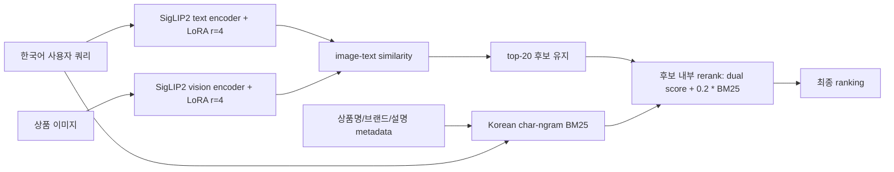

# Best Strategy

## 최종 선택

**Dual-tower r4 InfoNCE 10epoch + top-20 후보 보존 Korean BM25 rerank**

| R@1 | R@5 | R@10 | MRR |
|---:|---:|---:|---:|
| 0.700 | 0.833 | 0.900 | 0.757 |

## 구체적 pipeline

## 적용된 설정

- Backbone: `google/siglip2-base-patch16-384`
- Adaptation: text encoder와 vision encoder 양쪽에 LoRA 적용
- LoRA rank: `r=4`
- Loss: in-batch `InfoNCE`
- Epoch: `10`
- Rerank: 1차 dual retrieval의 top-20 후보만 유지
- Lexical signal: 상품명, 브랜드, 이미지 설명을 합친 문서에 Korean char-ngram BM25
- 선택 정책: BM25 weight/top-N은 train-split validation에서만 선택
- 선택된 reranker: `rerank_top20_0.2bm25`

## 왜 이 전략인가

1. dual-tower LoRA는 cached frozen image embedding을 쓰는 방식보다 novelty가 높다. text와 vision 양쪽 domain adaptation을 수행하기 때문이다.
2. BM25 rerank는 한국어 색상, 의류 타입, 프린트, 위치 단서처럼 metadata에 직접 남는 표현을 보완한다.
3. top-20 후보 보존 방식은 BM25가 gallery 전체를 뒤집지 못하게 하므로 R@10 손상을 제한한다.
4. 결과적으로 LoRA/BM25와 같은 R@1/R@5/R@10을 유지하면서 MRR을 더 높였다.

## 랜덤 선택과의 비교

| Method | R@1 | R@5 | R@10 | MRR |
| --- | ---: | ---: | ---: | ---: |
| Random ranking expected | 0.002 | 0.009 | 0.017 | 0.012 |
| Baseline-256 | 0.533 | 0.733 | 0.867 | 0.624 |
| Dual r4 10ep + BM25 | 0.700 | 0.833 | 0.900 | 0.757 |

랜덤 선택은 gallery size 588에서 정답 rank가 균등하다고 가정한 기대값이다. 최종 방법은 random 대비 R@1 약 411.6배, R@10 약 52.9배, MRR 약 64.0배 높다.

## 한계

R@5만 최적화하면 `Dual r8 InfoNCE 5ep` 또는 `Dual r4 InfoNCE 10ep`가 0.867로 더 높다. 따라서 최종 전략은 “모든 단일 metric에서 strict 최고”가 아니라, R@1/R@10을 유지하면서 MRR이 가장 높은 균형점이다.
