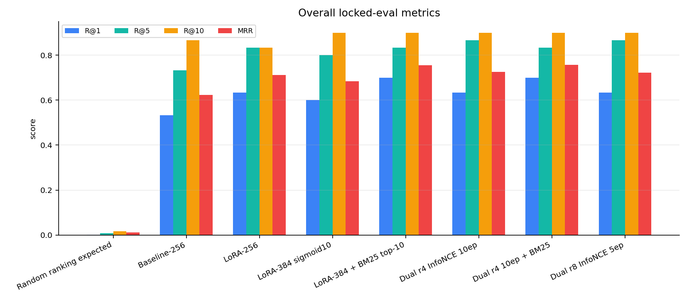
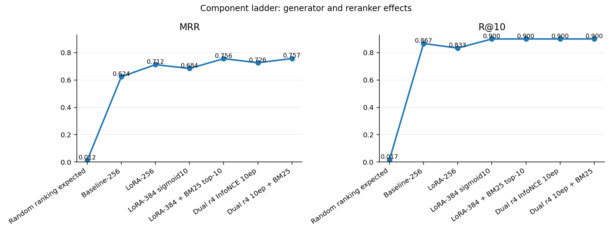
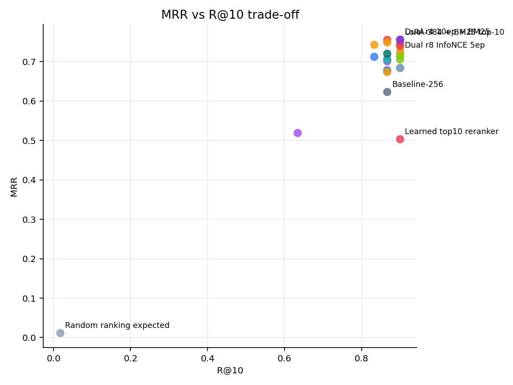
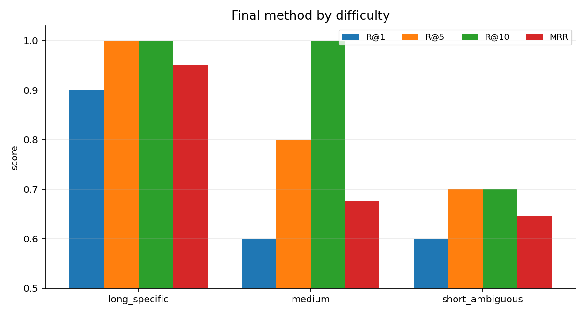
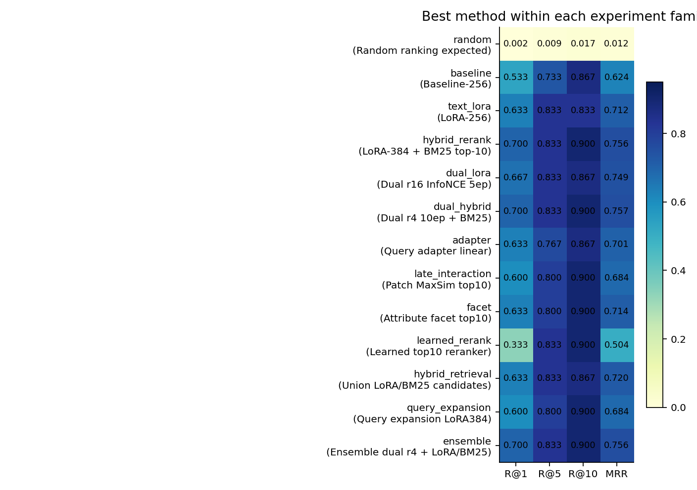
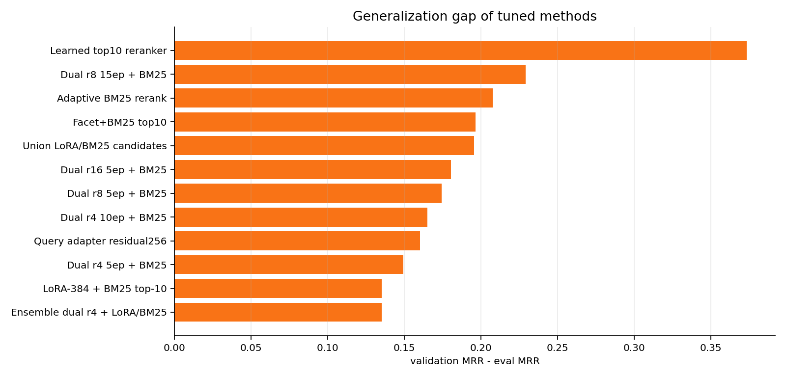
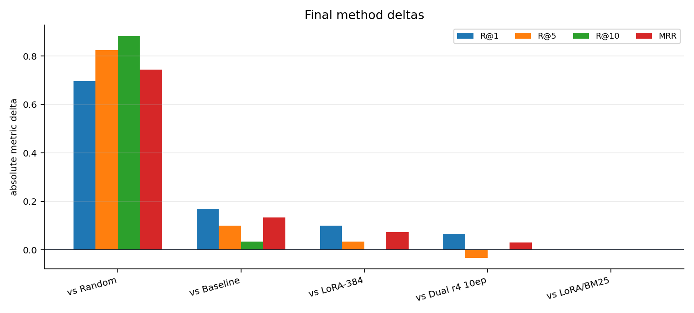

# Visualizations

## 1. 전체 metric 비교

해석: random expected는 gallery size 588 기준 하한선이다. final은 R@1/R@10을 최고 수준으로 유지하고 MRR이 가장 높다. R@5 단독 최고는 dual-only 계열이다.

## 2. 구성요소 ladder

해석: random에서 baseline, LoRA, dual+BM25로 올라가는 계단형 개선을 보여준다. dual r4 10epoch는 후보 recall을 회복하고, BM25가 첫 순위 품질을 보강한다.

## 3. MRR-R@10 trade-off

해석: final은 오른쪽 위에 있으며, R@10을 희생하지 않는 MRR 최고점이다.

## 4. 난이도별 final 성능

해석: long_specific은 강하지만 short_ambiguous가 가장 어려운 구간이다. 다음 개선은 짧고 모호한 쿼리의 disambiguation이 타깃이다.

## 5. 실험 family별 최고 성능

해석: dual_hybrid 계열이 MRR 기준 최고이며, learned rerank는 과적합 위험이 크다.

## 6. validation-eval gap

해석: validation 점수가 높은 방법이 locked eval에서 항상 좋지 않다. 특히 learned/adaptive 류는 작은 eval에서 과적합 리스크가 크다.

## 7. final delta

해석: final은 baseline과 LoRA-384 대비 뚜렷한 개선을 보이고, LoRA/BM25 대비로는 MRR만 소폭 개선한다.
