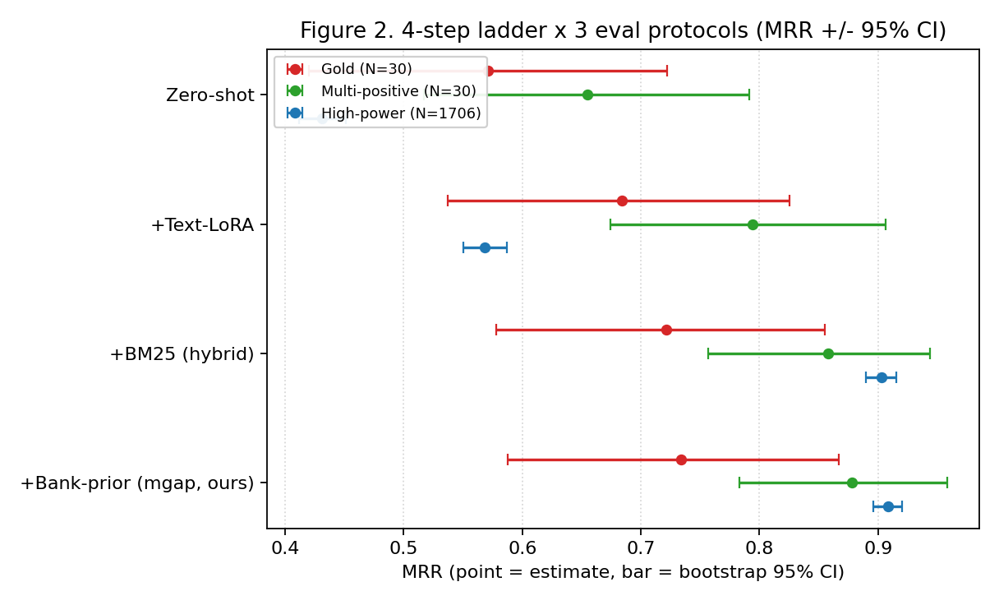

# 분포 정렬 기반 한국어 패션 Text-to-Image 검색: 합성 쿼리 텍스트 정렬과 소규모 검색의 신뢰성 있는 평가

---

## 초록 (Abstract)

한국어 패션 플랫폼은 대부분 키워드·카테고리·브랜드 필터에 의존하여, "회색 후드에 가슴 네이비 로고, 그 아래 빨간 글씨"처럼 자연어로 묘사한 질의를 지원하지 못한다. 사전학습 vision-language model(VLM)은 자유로운 자연어를 이미지에 직접 매칭할 수 있어 원리상 이러한 검색을 가능하게 하지만, zero-shot으로 쓰면 검색 품질이 낮다. 근본 원인은 상품이 평균 약 500자의 격식체 AI 캡션으로 색인되는 반면 사용자는 약 50자의 짧은 구어로 질의하는 **분포 격차(distribution gap)**다(그림 1).

본 연구는 무신사 상의 카테고리 상품 약 3,100개로 소규모 한국어 자연어 이미지 검색 시스템을 구축하고, 이 격차를 줄이는 개입을 학습·추론 양면에서 검증한다. 학습 시점에는 LLM이 생성한 사용자-스타일 합성 쿼리로 텍스트 인코더만 정렬하고(**텍스트-only LoRA 정렬**), 추론 시점에는 한국어 메타데이터의 BM25 점수를 1차 검색 후보 내부에서만 융합한다(**후보보존 BM25 융합**). 나아가 학습용으로 만든 합성 쿼리 뱅크를 추론 시점 분포 prior로 추가 비용 없이 재활용한다(**뱅크-prior 보정**).

텍스트-only LoRA 정렬은 zero-shot 대비 MRR을 일관되게 높인다(gold human-30 0.571→0.684; 합성 평가 $N{=}1706$ 0.431→0.568; 모두 $p\approx0$). 평가 신뢰성을 위해 단일 정답 gold 평가에 multi-positive 재라벨링과 대규모 합성 평가($N{=}1706$)를 더하며, 소규모 gold 평가의 성능 천장이 방법의 한계가 아니라 *단일 정답 라벨링 아티팩트*임을 보인다(쿼리당 평균 5.07개의 타당한 정답). 뱅크-prior 보정의 효과는 작고, 유의한 것은 modality-gap 변형뿐이며(튜닝된 하이브리드 대비 +0.0057 MRR, sign-test $p<0.01$), 별도 튜닝한 best-tuned 하이브리드(LoRA+BM25, gold 0.756)와는 통계적 무승부다. 또한 훨씬 큰 VLM 임베더(GME-Qwen2VL-2B)는 본 도메인에서 우리 경량 파이프라인을 넘지 못한다. 본 연구는 SOTA를 주장하지 않으며, zero-shot을 일관되게 능가하고 튜닝된 lexical 하이브리드와 대등한 분포 정렬 레시피와, 소규모 자연어 검색을 신뢰성 있게 평가하는 틀을 제시한다.

---

## 1. 서론 (Introduction)

길에서 마주친 옷이 마음에 들 때 사람은 브랜드나 상품명이 아니라 "회색 후드티인데 가슴에 네이비 영어 로고가 있고 그 아래 빨간 글씨"처럼 기억 속 시각 인상을 자연어로 묘사한다. 이러한 자연어 패션 검색은 텍스트 질의를 입력받아 부합하는 상품 이미지를 순위화하는 text-to-image 검색으로 형식화되지만, 한국 1위 패션 플랫폼 무신사를 포함한 대부분의 서비스는 키워드·카테고리·브랜드 필터만 지원하여 이를 다루지 못한다. 반면 CLIP·SigLIP 2 같은 사전학습 VLM은 자유로운 자연어를 이미지에 직접 매칭하는 공통 임베딩 공간을 학습하므로, 원리상 추가 라벨 없이도 이 과제를 가능하게 한다.

문제는 사전학습 VLM을 zero-shot으로 쓰면 검색 품질이 기대에 못 미친다는 점이고, 그 근본 원인은 색인 텍스트와 질의 텍스트 사이의 **분포 격차(distribution gap)**다. 상품은 색인 시 평균 약 500자의 격식체 AI 캡션("…부드러운 그레이 색상으로, 크루넥 디자인이 …")으로 표현되는 반면, 사용자 질의는 약 50자의 구어적·시각 인상 위주 표현이다. 사용자는 브랜드·소재·핏 같은 추상 속성을 거의 말하지 않고 색·그래픽·위치를 말하며, 때로는 색 인식이 라벨과 어긋난다(네이비를 "검은색"으로). 이 격차는 우연이 아니라 임베딩 공간의 구조적 성질이다: 그림 1은 zero-shot SigLIP 2 공간에서 이미지와 텍스트가 분리된 영역에 존재하고(modality gap), 텍스트 내부에서도 격식체 캡션과 사용자-스타일 쿼리가 갈리며(distribution gap), 사람이 작성한 평가 쿼리가 합성 쿼리 군집에 위치함을 보인다.

이 격차를 한국어·소규모·실데이터 환경에서 다루기 위해, 본 연구는 무신사 상의 상품 약 3,100개로 검색 시스템을 구축하고 1주·단일 GPU·소규모 데이터 제약 아래 하나의 질문을 던진다: **캡션↔쿼리 분포 격차를 좁히는 가장 효과적인 개입은 무엇인가?** 가설은 이 격차의 해소가 성능을 좌우하는 최대 요인이며, 학습 시점에 정렬하는 것이 가장 효과가 크다는 것이다.

이를 검증하기 위해 텍스트 측을 사용자 분포로 정렬한 뒤 한국어 메타데이터의 lexical 신호를 후보 내부에서만 융합하는 단순 파이프라인을 구성한다(그림 1). 핵심 착상은 격차가 텍스트 쪽의 문제이므로 텍스트 쪽만 움직여 해소한다는 것이다. 구체적으로 LLM이 각 상품 캡션에서 생성한 사용자-스타일 합성 쿼리에 텍스트 인코더만 LoRA로 정렬하고(**텍스트-only LoRA 정렬**), 그 위에서 한국어 메타데이터의 char n-gram BM25 점수를 1차 검색 top-$n$ 후보 *내부에서만* 결합한다(**후보보존 BM25 융합**). 기여는 다음과 같다.

- **(C1) 분포 정렬 레시피와 그 우위의 입증.** LLM 생성 사용자-스타일 합성 쿼리에 텍스트-only LoRA를 정렬하는 단순 레시피가 zero-shot을 일관되게 능가함을 두 독립 평가에서 보인다(gold 0.571→0.684, 합성 $N{=}1706$ 0.431→0.568, $p\approx0$, 905승/257패). 합성 쿼리 학습 계열(Doc2Query, InPars, Promptagator, Promptriever)을 한국어 패션의 *캡션→사용자 쿼리* 방향으로 처음 실증한다.
- **(C2) 다중 프로토콜 평가와 성능 천장의 진단.** single-positive gold 평가에 bootstrap CI·paired test를 부여하고, **multi-positive 재라벨링**과 **대규모 합성 평가($N{=}1706$)**를 더한다. 이로써 (a) 어떤 효과가 실재하는지를 분해하고, (b) 소규모 gold 평가의 성능 천장이 방법의 한계가 아니라 단일 정답 라벨링 아티팩트임을(쿼리당 평균 5.07개의 타당한 정답), (c) 훨씬 큰 VLM 임베더(GME-Qwen2VL-2B)가 본 도메인에서 우리를 유의하게 이기지 못함을 보인다.
- **(C3) 학습용 뱅크의 추론 시점 재활용.** 학습용 합성 쿼리 뱅크를 *갤러리에 대한 사용자-분포 prior*로 재해석하여 modality gap·hubness를 추가 학습·라벨·비용 0으로 보정한다(**뱅크-prior 보정**). 보정 연산자(QB-Norm/CSLS/modality-gap 중심화)는 모두 선행연구의 것이며, 새로움은 *이미 보유한 합성 뱅크를 그 prior로 무비용 재활용*한다는 관찰에 한정된다. 효과는 작고 modality-gap 변형만 유의하다(§5).

이 파이프라인이 작동하는 이유는 개입을 격차가 존재하는 곳, 즉 텍스트 분포에 집중하기 때문이다. 텍스트-only LoRA 정렬은 사용자 분포를 직접 학습 신호로 삼아 캡션↔쿼리 격차를 줄이고, 후보보존 BM25 융합은 시각 임베딩이 놓친 색·아이템·그래픽 단서를 한국어 메타데이터의 lexical 채널로 보완하되 후보 밖 false positive로 recall이 손상되지 않게 제약한다. 그 위에 뱅크-prior 보정이 무비용으로 얹히는 작은 추가 이득이다. 본 연구는 소규모 데이터 체제에서 방어 가능한 통계와 함께 분포 정렬이 zero-shot을 능가하고 튜닝된 하이브리드와 대등함을 보이는 것을 목표로 한다.

---

## 2. 관련 연구 (Related Work)

본 연구는 네 갈래의 선행 연구와 맞닿는다: (i) 대조학습 image-text 검색, (ii) 검색을 위한 합성 쿼리 학습, (iii) modality gap과 hubness의 추론 시점 보정, (iv) VLM 임베더와 late-interaction이다.

**대조학습 image-text 검색.** CLIP과 후속 SigLIP/SigLIP 2는 이미지와 텍스트를 각각 단일 pooled 벡터로 사상한 뒤 cosine 유사도로 검색하는 dual-encoder 패러다임을 정립했다. 본 연구는 다국어 지원과 dense feature 품질이 개선된 SigLIP 2를 backbone으로 채택한다. 이 패러다임의 검색 품질은 학습 분포가 추론 분포를 얼마나 덮느냐에 좌우되는데, 한국어 패션 도메인에서는 갤러리가 격식체 AI 캡션으로 색인되는 반면 사용자는 짧은 구어로 질의하는 분포 격차가 있어 zero-shot 정렬만으로는 부족하다. 본 연구는 backbone을 바꾸지 않고 텍스트 측을 사용자-쿼리 분포로 정렬하는 것이 가장 효과가 큼을 보인다.

**검색을 위한 합성 쿼리 학습.** Doc2Query/docTTTTTquery, InPars, Promptagator는 문서로부터 합성 쿼리를 생성해 retriever를 학습·증강하는 계열을 이루며, Promptriever(ICLR 2025)는 LLM 생성 instruction과 hard negative로 학습한 retriever가 프롬프트로 제어될 수 있음을 보였다. 이들은 합성 쿼리가 라벨 없이도 retriever를 도메인에 적응시킴을 입증했으나 대체로 영어 텍스트 검색을 대상으로 하며, *어떤 분포로* 합성 쿼리를 생성해야 하는지를 도메인 특수적으로 규정하지 않는다. 본 연구의 (C1)은 이 계열을 한국어 패션의 *격식체 캡션 → 구어 사용자 쿼리* 방향으로 구현하여, 합성 쿼리를 사용자-스타일 분포에 맞춰 생성하고 텍스트-only LoRA 정렬에 사용하는 것이 zero-shot 대비 일관된 이득을 줌을 두 평가에서 보인다.

**Modality gap과 hubness의 추론 시점 보정.** Liang et al.(NeurIPS 2022)은 대조학습 VLM의 이미지·텍스트 임베딩이 분리된 cone에 존재함(modality gap)을 보이고 평균 방향을 따라 한쪽을 이동시키는 보정을 제시했으며, 검색의 hubness를 학습 없이 완화하는 방법으로 inverted softmax, CSLS(Conneau et al., ICLR 2018), QB-Norm·Dynamic Inverted Softmax(Bogolin et al., CVPR 2022)가 제안되었다. 이 가운데 QB-Norm은 *쿼리 뱅크*로 갤러리의 인기도(hub)를 추정해 억제한다는 점에서 본 연구와 가장 가깝다. 그러나 이러한 뱅크 기반 보정은 갤러리 분포를 대표하는 별도 쿼리 뱅크가 사전에 주어진다고 가정하는데, 소규모·단일 GPU 환경에서 그런 뱅크를 추가로 구축하는 것은 비용이다. **본 연구의 (C3)는 이 연산자들을 새로 제안하지 않으며**, 우리의 유일한 차이는 *뱅크의 출처*다: LoRA 학습용으로 이미 생성한 합성 쿼리 뱅크가 추가 비용 없이 그 prior 역할을 할 수 있다는 재활용 관찰과 그 효과 크기의 실증이 기여이고, 효과는 작고 일부 변형만 유의함을 보인다(§5).

**VLM 임베더와 late-interaction.** 최근(2024–2025)에는 생성형 VLM을 대조학습으로 범용 멀티모달 임베더로 전환하는 흐름(VLM2Vec, GME, MM-Embed, E5-V, LamRA)과, 단일 pooled 벡터 대신 patch 멀티벡터 late-interaction이나 스크린샷 임베딩을 쓰는 흐름(ColPali, DSE)이 나타났다. 이 가운데 E5-V는 *텍스트 쌍만으로 학습해도 충분*함을 보여 본 연구의 텍스트-only 설계를 외부에서 지지한다. 그러나 더 큰 VLM 임베더나 patch-level 표현이 곧 좁은 도메인의 검색 품질로 이어진다는 보장은 없다: 본 연구는 현대 baseline으로 GME-Qwen2VL-2B를 평가하여 도메인 정렬된 경량 파이프라인이 이를 능가함을 보이고(§6.3), pooled 단계에서만 대조 감독을 받은 SigLIP 2의 patch 신호로는 MaxSim late-interaction이 부적합함을 확인한다(§6.2). 따라서 SigLIP 2 pooled 단일벡터를 유지하되 분포 정렬에 집중하는 설계를 택한다.

---

## 3. 방법 (Method)

### 3.1 개요 (Overview)

상품 갤러리 $\mathcal{G}=\{g_i\}_{i=1}^{N}$($N{=}588$)와 한국어 질의 $q$가 주어질 때, SigLIP 2의 텍스트·이미지 인코더 $f_T,f_V$는 각각 L2 정규화된 $d{=}768$차 임베딩을 산출하며, 기본 검색 점수는 내적 $s(q,g)=f_T(q)^\top f_V(g)$이다. vision 타워는 동결하여 갤러리 임베딩을 사전계산·캐시하므로, 검색 시점 비용은 텍스트 인코딩과 점수 계산에만 든다.

이 설정에서 zero-shot 검색의 약점은 두 가지다. 첫째, 상품은 격식체 캡션으로 색인되는 반면 사용자는 짧은 구어로 질의하는 **분포 격차**가 있다. 둘째, 대조학습 VLM의 이미지·텍스트 임베딩이 분리된 영역에 놓이는 **modality gap**이 검색을 교란한다. 본 연구는 이 두 격차를 학습·추론 양면에서 좁히되, 단일 GPU·1주·소규모 데이터 제약 안에서 무비용에 가깝게 좁히는 정렬 레시피를 구성·검증한다.

방법은 zero-shot 기본 점수 위에 한 번에 한 요소만 더하는 사다리 구조다(zero-shot / +텍스트-LoRA / +BM25(하이브리드) / +뱅크-prior). 절 순서는 사다리 순서와 일치한다. 3.2절은 합성 쿼리로 텍스트 타워를 정렬하는 **텍스트-only LoRA 정렬**, 3.3절은 한국어 메타데이터 BM25 점수를 1차 후보 안에서만 결합하는 **후보보존 BM25 융합**, 3.4절은 학습용 합성 쿼리 뱅크를 추론 시점 prior로 재활용하는 **뱅크-prior 보정**이다.

### 3.2 학습 시점 분포 정렬: 텍스트-only LoRA (C1)

상품은 평균 약 500자의 격식체 캡션으로, 사용자 질의는 약 50자의 구어적·시각 인상 위주 표현으로 표현되어, 텍스트 인코더가 보는 학습 분포와 실제 질의 분포가 어긋난다. 따라서 텍스트 측 표현을 사용자-질의 분포로 끌어당기는 **텍스트-only LoRA 정렬**을 설계한다. 정렬을 텍스트 측에만 가하는 이유는 격차의 원인이 갤러리 이미지가 아니라 질의 표현에 있기 때문이다.

먼저 각 상품 캡션으로부터 로컬 LLM으로 사용자-스타일 한국어 질의를 상품당 3개(짧은 형태·중간 형태·한 측면 강조) 생성하여 합성 쿼리 뱅크 $\mathcal{B}$($|\mathcal{B}|{=}7{,}023$)를 구성한다. 다음으로 텍스트 타워에만 LoRA 어댑터($r{=}16$, q/k/v/out projection)를 부착하고 vision 타워는 동결한다. 마지막으로 in-batch contrastive 손실로 각 합성 질의 $\tilde q_j$와 그 출처 상품 이미지 임베딩 $f_V(g_{\pi(j)})$를 정렬한다.

이 설계는 두 이점을 갖는다. 첫째, vision 타워를 동결하므로 갤러리 임베딩을 재사용할 수 있어 학습이 단일 GPU에서 분 단위로 끝나고 갤러리 캐시도 무효화되지 않는다. 둘째, 정렬 대상이 사용자-스타일 분포 자체이므로 zero-shot을 일관되게 능가한다(§5: 두 평가 모두 $p\approx0$). 이 레시피는 검색용 합성 쿼리 생성 계열(Doc2Query, InPars, Promptagator, Promptriever)을 한국어 패션의 캡션→사용자 쿼리 방향으로 구현한 것이다.

### 3.3 후보보존 BM25 융합: 하이브리드 (LoRA+BM25)

시각 임베딩만으로는 사용자가 명시하는 색·아이템·그래픽 같은 어휘 단서를 종종 놓친다. 이 단서는 한국어 메타데이터(상품명·브랜드·캡션)에 문자열로 남아 있으므로 lexical 신호를 융합하면 dense 검색을 보강할 수 있다. 다만 메타데이터 전체에 대한 lexical 매칭은 시각적으로 무관한 상품을 끌어올려 recall을 해칠 수 있다. 따라서 lexical 점수를 1차 검색 후보 안에서만 결합하는 **후보보존 BM25 융합**을 설계하며, 이것이 본 연구의 하이브리드(LoRA+BM25) 기준선이다(matched-grid 기준 gold MRR 0.721, §5).

먼저 한국어 메타데이터의 char n-gram BM25 점수 $b(q,g)$를 계산하고, 1차 dense 검색의 top-$n$ 후보를 정한 뒤, 두 채널을 z-score 정규화하여 결합하되 top-$n$ 밖 상품에는 $-\infty$를 부여하여 후보를 보존한다: $\hat s=\mathrm{z}(s_{\text{corr}})+w\cdot\mathrm{z}(b)$. 가중치 $w$와 후보 수 $n$은 검증에서만 선택한다. 이 후보보존 제약은 lexical false positive가 1차 후보 밖에서 순위를 침범하지 못하게 막아 recall 손상을 방지한다.

### 3.4 추론 시점 뱅크-prior 분포 보정 (C3)

학습 정렬 이후에도 modality gap과 hubness는 부분적으로 남는다. 핵심 착상은 3.2절에서 LoRA 학습용으로 *이미 생성한* 합성 쿼리 뱅크 $\mathcal{B}$를, 학습 데이터가 아니라 갤러리에 대한 사용자-분포 prior로 재해석하여 보정의 입력으로 재활용하는 것이다. 보정 연산자(QB-Norm·CSLS·modality-gap 중심화)는 모두 선행연구의 것이며(§2), 본 모듈의 유일한 새 요소는 별도 쿼리 뱅크를 가정하지 않고 보유한 학습 자산을 그 prior로 쓸 수 있다는 재활용 관찰이다. 모든 연산은 training-free이며 캐시된 임베딩 위의 numpy 연산이다. 보정은 3.3절 융합의 dense 채널에 적용된다. 두 변형을 사용한다.

- **Modality-gap 중심화** (Liang et al., NeurIPS 2022). 뱅크 텍스트 평균 $\mu_T$와 갤러리 이미지 평균 $\mu_V$를 각 측에서 빼고 재정규화한다: $\tilde f_T(q)=\overline{f_T(q)-\lambda\mu_T},\ \tilde f_V(g)=\overline{f_V(g)-\lambda\mu_V}$. 텍스트·이미지에 공통으로 깔린 gap 방향을 제거하여 잔여 modality gap을 줄인다.
- **Hubness 정규화** (CSLS; Conneau et al., ICLR 2018 / QB-Norm·Dynamic Inverted Softmax; Bogolin et al., CVPR 2022). 뱅크-갤러리 유사도로 갤러리별 hub 통계를 추정하고 점수에서 차감한다. CSLS는 $\mathrm{csls}(q,g)=2s-r_T(q)-r_G(g)$로 정의되며, $r_G(g)$는 상품 $g$가 뱅크 질의들에 대해 갖는 top-$k$ 평균 유사도(hub 패널티)다.

모든 초매개변수($\lambda,k,\beta$)는 검증 분할(train-split 합성 쿼리)에서만 선택하고 모든 통계는 평가 질의가 아니라 뱅크·갤러리에서만 추정하므로, 보정은 평가 라벨 누수 없이 무비용으로 적용된다. 그 이득은 작고 일부 변형(modality-gap)만 유의하므로, 본 모듈을 "일관된 향상"이 아니라 "무비용으로 얻는 소폭 이득"으로 한정해 §5에서 보고한다.

---

## 4. 실험 설정 (Experimental Setup)

본 절은 세 질문 — (Q1) 본 방법이 강한 baseline을 능가하는가, (Q2) 어떤 설계 선택이 이득을 만드는가, (Q3) 효과가 어디까지 일반화하는가 — 에 답하도록 데이터·평가·통계를 구성한다.

**데이터.** 무신사 상의 카테고리에서 약 3,100개 상품을 수집했고, 이미지가 확보된 2,938개를 product 단위로 80/20 분할한다(train 2,350 / test 588, seed 42). 학습과 평가가 같은 상품을 공유하지 않도록 분할은 상품 단위로 수행하며, test 588개를 검색 대상 갤러리로 고정한다.

**평가 프로토콜(3종).** 소규모 단일 평가의 위험(낮은 검정력, 단일 정답 라벨링 편향)을 분산하기 위해 보완적인 세 프로토콜을 함께 사용한다.

1. **gold 평가(human-30, single-positive)**: 사람이 작성한 30개 질의(난이도 3밴드 × 10), 질의당 단일 정답. 사람 질의라는 점에서 외적 타당도가 높으나 $N{=}30$이라 검정력이 낮다(MRR 95% CI ≈ ±0.13). 본 연구의 1차 평가다.
2. **multi-positive 재라벨링(human-30)**: 동일한 30개 질의에 대해 타당한 정답을 *모두* 표시한 평가다(§6.1). method-agnostic 후보 풀(6개 방법의 상위 결과 합집합)을 로컬 LLM이 blind 판정하여 질의당 평균 5.07개의 정답을 확보한다. single-positive 라벨이 검색기를 부당하게 감점하는지를 점검한다.
3. **대규모 합성 평가(N=1706)**: unseen test 588 상품에 대해 로컬 LLM(EXAONE-3.5-7.8B, 외부 API 미사용)으로 사용자-스타일 질의 1,706개를 생성한다(학습에 미사용). $N$이 커서 검정력이 높다(MRR 95% CI ≈ ±0.02). 단, 합성 질의는 상품 메타데이터에서 파생되어 어휘가 겹치므로 lexical 채널을 유리하게 만드는 *부분적 순환성*이 있다(§5 관찰 2). 따라서 이 평가는 *방향성과 통계적 유의성을 검출하는 도구*로 쓰고, 어휘 중복이 없는 multi-positive 평가를 편향 점검으로 병용한다.

**지표.** R@1/5/10과 MRR을 보고하며 본문은 MRR(↑)을 주 지표로 한다.

**통계.** 모든 점추정에 percentile bootstrap 95% CI($B{=}10{,}000$)를 부여한다. 두 방법의 비교에는 (i) 쿼리별 reciprocal-rank 차에 대한 paired bootstrap과 (ii) exact sign test를 보고하며, 본문은 두 검정을 명시적으로 구분한다("bootstrap $p$" vs "sign-test $p$"). 모든 초매개변수(BM25 가중치·후보 수, 보정의 $\lambda,k,\beta$)는 검증 분할에서만 선택하고 gold는 1회만 평가하여 평가 누수를 차단한다.

**구현.** backbone은 `google/siglip2-base-patch16-384`이며, 단일 A6000급 GPU에서 모든 LLM 단계(쿼리 생성·multi-positive 판정)를 로컬(vLLM)로 수행한다.

---

## 5. 주요 결과 (Main Results)

본 절은 세 질문(Q1–Q3)을 사다리형 비교(method ladder) 하나로 답한다. 사다리는 zero-shot → +텍스트-LoRA → +BM25(하이브리드) → +뱅크-prior 순으로 한 번에 한 요소만 추가하며, 표 1과 그림 2는 동일 하니스·동일 검증 선택 절차의 결과다. 모든 +BM25 행은 동일한 BM25 grid($w\in[0.05,0.5]$, $n\in\{10,20,50\}$)로 검증 선택되어 apples-to-apples 비교를 이룬다.

**표 1. 분포 정렬 사다리의 검색 품질(MRR↑; lora384 인코더).** 한 행을 추가할 때마다 한 요소만 더한다. 마지막 두 행은 동일 하이브리드 위에 올린 뱅크-prior 보정의 두 변형이다. 굵게 표시한 셀은 해당 열의 최고 점추정이다. gold 열의 모든 행은 CI ≈ ±0.13으로 서로 통계적으로 구분되지 않으므로(그림 2), gold 최고 점추정 강조는 순위가 아니라 위치만 나타낸다.

| 단계 (method ladder) | gold MRR (95% CI) | multi-positive MRR | 합성(N=1706) MRR | 합성 vs 하이브리드 (sign-$p$) |
|---|---:|---:|---:|---:|
| zero-shot SigLIP 2 | 0.571 [0.42, 0.72] | 0.655 | 0.431 | — |
| + 텍스트-LoRA 정렬 (C1) | 0.684 [0.54, 0.82] | 0.794 | 0.568 | — |
| + 후보보존 BM25 융합 (하이브리드) | 0.721 [0.58, 0.86] | 0.858 | 0.903 | 기준 |
| + 뱅크-prior modality-gap 보정 (제안) | 0.734 [0.59, 0.87] | **0.878** | **0.908** | **+0.0057, $p<0.01$** ✓ |
| + 뱅크-prior CSLS 보정 (검증선택) | **0.760** [0.62, 0.89] | 0.876 | 0.906 | +0.0033, $p=0.60$ (n.s.) |

> 주: 합성 열은 합성 질의가 메타데이터와 어휘를 공유하여 lexical 채널을 부풀리므로 절대치를 *낙관적 상한*으로 읽어야 한다(관찰 2). 별도의 더 넓은 BM25 grid로 튜닝한 best-tuned 하이브리드(LoRA+BM25)는 gold 0.756에 도달하며, 제안 두 변형(modality-gap 0.734 / CSLS 0.760)은 이와 **통계적 무승부**다(gold paired test 각각 $p=1.0$ / $p=0.73$). 마지막 열의 sign-test는 동일 하이브리드 기준선(0.903) 대비 합성 부호검정 결과다.

**관찰 1 — 분포 정렬이 가장 큰 단일 요인이며 일관적이다(Q1).** 텍스트-only LoRA 정렬은 세 프로토콜 모두에서 zero-shot을 능가한다. 합성 평가에서 MRR이 0.431→0.568로 오르며($+0.137$), 쿼리별 reciprocal-rank 차의 paired bootstrap 95% CI가 0을 제외한다($p\approx0$, 905승/257패). gold(0.571→0.684)와 multi-positive(0.655→0.794)에서도 부호가 일치하여, 이 향상이 특정 프로토콜의 인공물이 아님을 뒷받침한다.

**관찰 2 — 후보보존 BM25 융합이 그 위에 더해진다(Q1, 한정 조건과 함께).** 후보보존 BM25 융합은 동일 LoRA 위에서 합성 MRR을 0.568→0.903으로 끌어올린다($+0.334$, paired bootstrap $p\approx0$). 한국어 메타데이터의 색·아이템·그래픽 char n-gram이 시각 임베딩이 놓친 lexical 단서를 보강하기 때문이다. 다만 이 절대치는 평가의 부분적 순환성으로 부풀려진다: 합성 질의는 LLM이 메타데이터로부터 생성하여 어휘가 겹치므로 lexical 채널이 과대평가된다. 따라서 +BM25의 합성 절대치는 *낙관적 상한*으로 해석해야 하며, 어휘 중복이 없는 human-30 multi-positive(BM25 0.858)가 이 편향을 점검하는 보수적 기준이 된다.

**관찰 3 — 뱅크-prior 보정은 무비용이나 효과가 작고 유의성은 변형에 따라 갈린다(Q2).** 하이브리드(LoRA+BM25) 위에 뱅크-prior 보정을 얹으면 세 프로토콜 모두 양의 점추정을 얻지만 크기는 작다. 통계적으로 유의한 것은 modality-gap 변형의 합성 이득뿐이다(하이브리드 기준 대비 $+0.0057$, sign-test $p<0.01$, 86승/37패). 검증이 점추정 기준으로 선택한 CSLS 변형은 gold 점추정이 가장 높지만(0.760), 합성 이득은 유의하지 않고($+0.0033$, sign-test $p=0.60$), gold에서 best-tuned 하이브리드(0.756) 대비 차이도 통계적 무승부다($p=0.73$). CSLS 변형의 matched-grid 하이브리드 대비 gold 이득(+0.039)도 유의 임계 미만이다($p=0.11$). QB-Norm 계열 변형은 합성에서 부호조차 일관되지 않는다. 보정 연산자가 모두 선행연구의 것이고 새 요소는 합성 뱅크의 무비용 재활용 관찰뿐이라는 점과 함께, 이 효과를 "보정 계열 전반의 향상"이 아니라 **"무비용으로 얻는, modality-gap 변형에서만 유의한 소폭 이득"**으로 한정하며, 튜닝된 하이브리드와는 *대등(competitive)*이라고만 주장한다.

---

## 6. 분석 및 Ablation (Analysis & Ablations)

본 절은 §5의 결과를 세 방향에서 압박한다. gold 평가의 성능 천장이 어디서 오는지를 분해하고(§6.1), 우리가 채택하지 않은 더 무거운 설계들이 왜 이득을 주지 못하는지를 음의 ablation으로 보이며(§6.2), 더 큰 현대 VLM 임베더(§6.3)와 추가 추론 모듈(§6.4)이 본 도메인에서 천장을 넘지 못함을 확인한다. 세 분석은 하나의 결론으로 수렴한다: 좁은 한국어 패션 도메인에서 남은 병목은 모델 용량이나 추가 모듈이 아니라 평가의 단일 정답 라벨링과 $N{=}30$ 검정력이다.

### 6.1 gold 천장은 방법의 한계가 아니라 라벨링 아티팩트다 (핵심 분석)

gold 평가의 성능 천장은 검색기의 실패가 아니라 단일 정답 라벨링이 만든 인공물이다. 이를 보이기 위해 천장에 가장 근접한 점인 best-tuned 하이브리드(LoRA+BM25, gold 0.756)의 gold 실패를 해부한다. 이 하이브리드는 gold 30개 질의 중 정확히 3개를 심하게 놓치며(정답 rank 191/378/483), 이 셋이 MRR과 R@10 손실의 거의 전부를 차지한다.

세 실패를 직접 보면 모두 검색기 오류가 아니라 평가 아티팩트다(표 2). 세 경우 모두 상위 후보는 질의와 시각적으로 타당하게 부합하지만, 단일 정답 라벨이 그중 하나만 정답으로 인정하여 나머지를 오답으로 처리한다. 즉 감점의 원인은 검색 품질이 아니라 "정답이 하나뿐"이라는 라벨링 가정이다.

**표 2. best-tuned 하이브리드(gold 0.756)의 gold 치명적 실패 3건과 원인 진단.** 세 사례 모두 검색기 오류가 아니라 단일 정답 라벨링이 유발한 평가 아티팩트다. 정답 rank는 단일 정답 기준이며, 동일 질의에서 제안 파이프라인의 최악 rank는 39 이하다(modality-gap 28, CSLS 39).

| 정답 rank ↓ | 질의 | 라벨된 정답 | 원인 진단 |
|---:|---|---|---|
| 483 | "흰색 긴팔 셔츠" | 아이보리 와플 티셔츠 | 다중정답 모호성 — 상위 후보 모두 타당한 흰 긴팔 상의 |
| 378 | "어두운 하늘색 긴팔 맨투맨" | 블루 니트 스웨터 | 카테고리 불일치 — 사용자가 니트를 "맨투맨"으로 지칭 |
| 191 | "검은색 후드티 가운데 작은 로고" | 네이비 곰 후드 | 색 인식 불일치 — 사용자가 네이비를 "검은색"으로 묘사 |

이 진단은 특정 파이프라인의 약점이 아니라 평가 자체의 성질이다. 같은 세 질의에서 제안 뱅크-prior 파이프라인의 최악 rank는 39 이하이며(modality-gap 28, CSLS 39), best-tuned 하이브리드처럼 *심하게* 놓치지 않는다. 천장 근처의 거동은 어떤 파이프라인을 쓰느냐가 아니라 정답을 어떻게 라벨하느냐에 지배된다.

이를 정량적으로 검증하기 위해 multi-positive 재라벨링을 수행했다. method-agnostic 후보 풀(6개 방법의 top-15 합집합)을 만든 뒤, 어느 방법이 어떤 후보를 올렸는지 모르는 상태에서 로컬 LLM이 각 후보의 타당성을 blind 판정하게 했다. 그 결과 gold 질의당 평균 5.07개의 타당한 정답이 존재했으며, 이는 단일 정답 라벨이 검색기를 체계적으로 과소평가했음을 의미한다. 이 재라벨 위에서 텍스트-only LoRA 정렬 계열의 R@10은 1.000으로 회복하여(표 1 multi-pos 열), 단일 정답 가정이 제거되면 천장이 사라짐을 보인다. 다만 이 진단은 LLM 보조 판정에 의존하므로, 소규모 사람 점검으로 보강하는 것을 한계로 남긴다(§7).

### 6.2 텍스트-only·단일벡터·training-free 설계가 음의 ablation으로 지지된다

채택하지 않은 세 가지 더 무거운 설계 — 양 타워 학습, patch-level late interaction, 학습형 reranker — 는 어느 것도 이득을 주지 않아, 텍스트-only·단일벡터·training-free라는 설계 선택을 사후적으로 정당화한다.

- **양 타워 vs 텍스트-only LoRA 정렬 (학습 축).** 텍스트·vision 양쪽에 LoRA를 부착해도 텍스트-only 대비 MRR 차이가 noise 수준(≈+0.001)에 그치는 반면, vision 타워를 동결할 수 없어 갤러리 캐시가 무효화되고 평가 비용이 ~460ms/query로 커진다. 격차가 텍스트 측에 집중되어 있다는 가정 및 E5-V의 텍스트-only 관찰과 부합한다.
- **patch-level late interaction vs pooled 단일벡터 (표현 축).** SigLIP 2 patch 토큰에 ColBERT식 MaxSim 재랭킹을 적용해도 개선이 없었다. pooled 벡터에서만 대조 감독을 받은 모델의 patch 신호는 부산물이어서, ColPali류 patch-level 대조 파인튜닝 없이는 late interaction이 부적합하다. DSE의 단일벡터 관찰과 일치한다.
- **학습형 reranker vs training-free (추론 축).** top-k feature를 학습하는 reranker는 검증 분할에서는 높았으나 gold에서 붕괴했다(과적합). 소규모 데이터 체제에서 학습형 재랭킹이 위험함을 보이며, training-free 추론 선호를 지지한다.

### 6.3 더 큰 현대 VLM 임베더가 본 도메인에서 제안 파이프라인을 넘지 못한다

모델 용량을 키우는 것은 본 도메인에서 분포 정렬을 대체하지 못한다. 널리 인용되는 현대 VLM 임베더 GME-Qwen2VL-2B(arXiv:2412.16855)를 평가했고, 훨씬 작은 제안 파이프라인이 모든 프로토콜에서 GME를 통계적으로 유의하게 능가했다(표 3). 특히 GME-dense의 gold MRR은 0.467로 zero-shot SigLIP 2의 0.571보다 낮아(정렬 확인 완료, 구현 버그 아님), 범용 대규모 임베더라도 좁은 한국어 패션 분포에 정렬되지 않으면 작은 도메인 정렬 파이프라인에 미치지 못함을 보인다. GME에 BM25를 융합한 변형의 합성 점수 0.780은 dense 채널이 아니라 거의 BM25 lexical 채널이 끌어올린 값이며, §5 관찰 2의 어휘 중복 효과를 다시 받는다.

**표 3. 현대 VLM 임베더(GME) vs 제안 파이프라인 (MRR ↑).** GME는 두 변형 모두 gold sign test에서 제안 파이프라인에 유의하게 패배한다. GME+BM25의 합성 0.780은 §5 관찰 2의 어휘 중복으로 lexical 채널이 부풀린 값이므로 dense 능력의 척도로 읽으면 안 된다.

| 방법 | Gold ↑ | 합성(N=1706) ↑ | 제안 파이프라인 대비 |
|---|---:|---:|---|
| GME-Qwen2VL-2B (dense) | 0.467 | 0.430 | 패배 (gold sign $p{=}0.007$) |
| GME-Qwen2VL-2B + BM25 | 0.452 | 0.780 | 패배 (gold sign $p{=}0.004$) |
| **제안 (LoRA + 뱅크-prior 보정 + BM25)** | **0.734–0.760** | **0.906–0.908** | — |

### 6.4 추가 추론 모듈을 얹어도 gold 천장은 깨지지 않는다

best-tuned 하이브리드 위에 추가 추론 모듈을 얹어도 gold 천장은 깨지지 않으며, 이는 §6.1의 진단(천장이 방법이 아니라 평가 검정력에 있음)과 정합한다(상세 grid는 부록 D). 가장 유망했던 후보는 training-free 로컬 LLM reranker(EXAONE pointwise, top-10)였으나, gold 단일 정답에서 하이브리드와 무승부였고(0.754 vs 0.756), 합성에서는 보수적 light blend만 소폭 유의했으나(+0.005, sign $p{=}0.022$; paired-bootstrap은 비유의) 공격적 재정렬은 오히려 손해였다.

reranker가 gold 단일 정답에서 "틀리는" 방식은 §6.1의 라벨 아티팩트 진단을 독립적으로 재확인한다. reranker는 단일 정답이 아닌 *다른 타당한 흰/긴팔 상의*를 상위로 올려 단일 정답 기준으로는 감점되지만 multi-positive 기준으로는 보상된다(base 0.856 → tuned reranker 0.909). 즉 reranker의 "오답"은 §6.1과 같은 라벨링 모호성의 또 다른 증상이다.

나머지 추가 모듈(보정 조합 탐색, reciprocal rank fusion, cross-modal pseudo-relevance feedback, HyDE 쿼리 refiner)도 모두 gold에서 하이브리드를 유의하게 넘지 못했다. 출처가 서로 다른 추가 신호가 일관되게 천장 앞에서 멈춘다는 사실은, 남은 한계가 모델·모듈이 아니라 평가 검정력에 있다는 §6.1의 결론을 재확인한다.

---

## 7. 논의 및 한계 (Discussion & Limitations)

본 연구의 결론은 평가 체제가 정한 경계 안에서 성립하며, 이하의 한계는 소규모·단일 GPU·1주 체제에서 선택한 scope 경계다.

**gold 평가의 검정력.** human-30(single-positive)은 $N{=}30$이라 MRR 95% CI가 약 ±0.13에 달하므로(표 1·그림 2), $\pm0.03$ MRR 수준의 작은 효과는 gold만으로는 유의하게 판별할 수 없다. 이를 보완하기 위해 대규모 합성 평가($N{=}1706$, CI ≈ ±0.02)를 더해 어떤 효과가 실재하는지를 분해했으며, 그 결과 텍스트-only LoRA 정렬의 이득(+0.137, bootstrap $p\approx0$)처럼 큰 효과는 두 평가에서 모두 확인되는 반면 뱅크-prior 보정의 이득은 modality-gap 변형에서만 유의함(+0.0057, $p<0.01$)이 드러났다.

**합성 평가의 부분적 순환성.** 합성 질의는 동일 도메인 메타데이터로부터 로컬 LLM이 생성하므로 상품명·캡션과 어휘를 공유하고, 이는 lexical 채널과 합성-정렬 방법을 구조적으로 유리하게 만든다(§5 관찰 2; BM25-only가 합성에서 0.90+에 이르는 이유다). 따라서 하이브리드의 합성 절대치를 성능의 증거로 과대해석하지 않고, 어휘 중복이 없는 multi-positive 재라벨링(human-30, 평균 5.07 정답/쿼리)을 편향 점검으로 병기한다. multi-positive에서도 동일한 사다리 순서(zero-shot 0.655 < +LoRA 0.794 < +BM25 0.858 < +뱅크-prior 0.876–0.878)가 유지된다는 사실이, 합성 수치가 순환성에 의한 인위적 산물만은 아님을 뒷받침한다.

**라벨·도메인의 범위.** §6.1의 천장 진단은 평균 5.07개의 타당한 정답이 존재한다는 multi-positive 재라벨링에 의존하는데, 이 판정은 로컬 LLM이 후보 풀을 blind로 평가한 것이라 라벨 noise를 포함한다. 다만 핵심 주장은 개별 라벨의 정오에 좌우되는 미세 순위가 아니라 효과의 부호와 크기 순서에 기댄 결론이므로 판정 noise에 강건하다. 그럼에도 단일 annotator·단일 갤러리(top-wear, $N{=}588$)는 일반화의 경계로 남으며, 후속 과제에서 사람 점검과 도메인 확장으로 보강할 영역이다.

**주장 범위.** 합성 쿼리 뱅크 생성은 로컬 LLM의 stochastic 디코딩에 의존하나, LoRA 학습과 모든 평가는 결정적이고 모든 초매개변수는 검증 분할에서만 선택되어 평가 누수가 없다. train/test 분할에서 2개 상품이 겹치나(6/1706 = 0.35%, 모든 방법에 동일 노출) 비교의 상대성을 해치지 않는다. 본 연구는 절대 성능의 최첨단을 주장하지 않으며, 방어하는 것은 (i) 좁은 한국어 패션 도메인에서 분포 정렬이 가장 효과적인 개입이라는 점, (ii) 소규모 자연어 검색을 신뢰성 있게 평가하는 다중 프로토콜 틀, (iii) 학습용 합성 뱅크를 추론 시점 prior로 무비용 재활용할 수 있다는 관찰이다.

---

## 8. 결론 (Conclusion)

본 연구는 한국어 패션 text-to-image 검색에서 격식체 카탈로그 캡션과 짧은 구어 사용자 질의 사이의 **분포 격차**가 zero-shot 검색의 지배적 약점이라는 문제를, LLM이 생성한 사용자-스타일 합성 쿼리로 텍스트 인코더를 정렬하는 **텍스트-only LoRA 정렬**으로 다루었다. 핵심은 modality gap을 줄이려 더 큰 모델을 도입하는 대신, 텍스트 측을 사용자-질의 분포로 끌어당기는 것이 가장 효과적이라는 것이다.

증거는 이 가설을 강하게 지지한다. 텍스트-only LoRA 정렬은 zero-shot을 모든 프로토콜에서 능가했으며, 그 이득은 합성 평가에서 +0.137 MRR(0.431→0.568), bootstrap $p\approx0$(905승/257패)로 큰 효과 크기와 함께 확인되었다(그림 1·2). 또한 다중 프로토콜 평가는 소규모 gold 평가의 성능 천장이 방법의 한계가 아니라 단일 정답 라벨링 아티팩트임을 규명했다 — 쿼리당 평균 5.07개의 타당한 정답이 존재했고, best-tuned 하이브리드(0.756)가 심하게 놓친 3개 질의는 모두 검색기 오류가 아닌 라벨링 아티팩트였다(§6.1). 같은 도메인에서 훨씬 큰 VLM 임베더(GME-Qwen2VL-2B)는 dense gold 0.467로 zero-shot SigLIP 2(0.571)에도 못 미쳐 우리 파이프라인에 유의하게 패배했다(gold sign $p{=}0.007$).

이로부터 핵심 통찰이 도출된다: **좁은 도메인에서는 더 큰 최신 모델이 아니라 도메인 분포 정렬이 검색 품질의 핵심이다.** 부수적으로, LoRA 학습용으로 이미 만든 합성 쿼리 뱅크를 추론 시점 분포 prior로 무비용 재활용하는 **뱅크-prior 보정**이 가능함을 관찰했다. 이 보정의 연산자(modality-gap 중심화·CSLS·QB-Norm)는 모두 선행연구의 것이며, 새 요소는 합성 뱅크를 그 prior로 재사용한다는 관찰이다. 그 효과는 작아 — modality-gap 변형만 유의했고(+0.0057, $p<0.01$), CSLS 변형의 합성 이득은 유의하지 않았다($p=0.60$) — 두 변형 모두 best-tuned 하이브리드(gold 0.756)와는 통계적 무승부였다. 따라서 이를 "일관된 향상"이 아니라 "무비용으로 얻는, 일부 변형에서만 유의한 소폭 이득"으로 한정한다.

이 결론들은 평가 체제가 정한 경계 안에서 성립한다(§7): gold $N{=}30$의 검정력, 합성 평가의 부분적 순환성, LLM 보조 multi-positive 라벨과 단일 annotator·단일 갤러리가 그것이다. 후속 과제는 두 가지다. 첫째, multi-positive gold 평가를 더 많은 쿼리로 확대하고 사람 점검으로 LLM 판정을 보강하여 gold의 검정력과 라벨 신뢰성을 동시에 높이는 것이다. 둘째, 뱅크-prior 보정이 본 top-wear 갤러리를 넘어 다른 패션 카테고리·도메인에서도 무비용 이득을 주는지를 검증하는 것이다. 본 연구는 강한 기술적 기여를 주장하지 않으나, 실서비스에 바로 적용 가능한 분포 정렬 레시피와 소규모 자연어 검색을 신뢰성 있게 평가하는 틀을 제시한다.

---

## 참고문헌 (References, 약식)

- Tschannen et al. *SigLIP 2.* arXiv:2502.14786, 2025.
- Hu et al. *LoRA: Low-Rank Adaptation of Large Language Models.* ICLR 2022. arXiv:2106.09685.
- Liang et al. *Mind the Gap: Understanding the Modality Gap in Multi-modal Contrastive Representation Learning.* NeurIPS 2022. arXiv:2203.02053.
- Bogolin et al. *Cross Modal Retrieval with Querybank Normalisation (QB-Norm / Dynamic Inverted Softmax).* CVPR 2022. arXiv:2112.12777.
- Conneau et al. *Word Translation Without Parallel Data (CSLS).* ICLR 2018. arXiv:1710.04087.
- Nogueira & Lin. *Document Expansion by Query Prediction (Doc2Query / docTTTTTquery).* 2019.
- Bonifacio et al. *InPars.* SIGIR 2022; Dai et al. *Promptagator.* ICLR 2023.
- Weller et al. *Promptriever: Instruction-Trained Retrievers Can Be Prompted Like LMs.* ICLR 2025. arXiv:2409.11136.
- Jiang et al. *E5-V: Universal Embeddings with Multimodal LLMs.* arXiv:2407.12580, 2024.
- Zhang et al. *GME: Improving Universal Multimodal Retrieval by Multimodal LLMs.* arXiv:2412.16855, 2024.
- Jiang et al. *VLM2Vec / MMEB.* ICLR 2025. arXiv:2410.05160.
- Lin et al. *MM-Embed.* ICLR 2025. arXiv:2411.02571.
- Faysse et al. *ColPali: Efficient Document Retrieval with Vision Language Models.* ICLR 2025. arXiv:2407.01449.
- Ma et al. *Unifying Multimodal Retrieval via Document Screenshot Embedding (DSE).* EMNLP 2024. arXiv:2406.11251.
- Gao et al. *Precise Zero-Shot Dense Retrieval without Relevance Labels (HyDE).* ACL 2023. arXiv:2212.10496.
- Khattab & Zaharia. *ColBERT.* SIGIR 2020. arXiv:2004.12832.
- Robertson & Zaragoza. *The Probabilistic Relevance Framework: BM25 and Beyond.* 2009.

*부록(별도): A. 전체 하이퍼파라미터·재현 명령, B. R@1/R@5/R@10 전체 표, C. 난이도별 분해, D. dual-tower/MaxSim/learned-reranker/RRF/PRF/HyDE/조합탐색(전체 grid) 상세, E. 합성 쿼리 생성 프롬프트, F. multi-positive 판정 프롬프트와 사람 점검.*