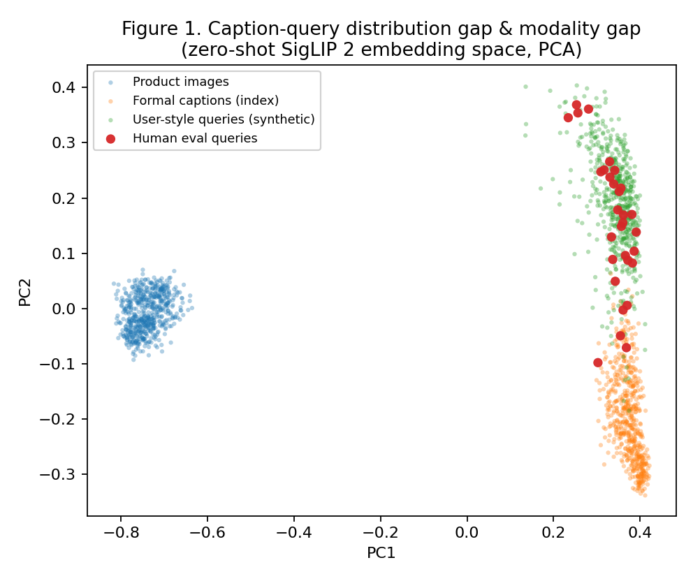

# 분포 정렬로 zero-shot을 넘어서는 한국어 패션 Text-to-Image 검색: 합성 쿼리 기반 텍스트 정렬과 후보보존 BM25 융합

*(v2 — 사실관계 정정·bank-prior 재프레이밍, 적대적 2인 리뷰 + 탑티어 학회(ICLR/ICML/NeurIPS) 컨벤션 검증 반영)*

---

## 초록 (Abstract)

한국 1위 패션 플랫폼 무신사를 포함한 대부분의 패션 서비스는 키워드·카테고리·브랜드 필터만 지원하여, "회색 후드에 가슴 네이비 로고, 그 아래 빨간 글씨"처럼 자연어로 묘사한 쿼리를 다루지 못한다. 사전학습 vision-language model(VLM)은 자유로운 자연어를 이미지에 직접 매칭할 수 있어 원리상 이러한 검색을 가능하게 하지만, zero-shot으로 쓰면 검색 품질이 낮다. 자연스러운 대안인 기존 패션 image-text 데이터셋(FashionPedia·FACAD·FashionGen 등)으로의 파인튜닝은 이 과제에 맞지 않는다: 이들은 영어이며 패션 전문용어가 섞인 긴 카탈로그형 서술이라, 짧은 구어체 한국어 쿼리와 분포가 크게 달라 격차를 메우지 못한다. 그래서 우리는 무신사 상의 상품 약 3,100개의 이미지만 수집한 뒤 이를 GPT-4o로 직접 캡션(평균 약 512자의 격식체 한국어)한다. 그러나 이렇게 만든 캡션조차 길고 격식체여서 짧은 사용자 쿼리(약 37자)와 어긋나며, 이 **캡션↔쿼리 분포 격차(distribution gap)**가 zero-shot 검색의 지배적 약점이 된다.

본 연구는 이 격차를 줄이는 개입을 학습·추론 양면에서 검증한다. 학습 시점에는 LLM이 생성한 사용자-스타일 합성 쿼리로 텍스트 인코더만 정렬한다(**텍스트-only LoRA 정렬**). 추론 시점에는 1차 dense 검색의 상위 후보 안에서만 한국어 메타데이터(상품명·브랜드·캡션)의 BM25 어휘 점수를 dense 점수에 가중 합산하여, 후보 밖 오검출 없이 색·아이템·그래픽 같은 어휘 단서를 보강한다(**후보보존 BM25 융합**). 나아가 학습용으로 만든 합성 쿼리 뱅크를 추론 시점 분포 prior로 (주 방법 대비) 추가 비용 없이 재활용한다(**뱅크-prior 보정**).

텍스트-only LoRA 정렬만으로도 실제 사용자 쿼리에서 zero-shot을 유의하게 능가하며(MRR 0.571→0.684, sign-test $p{=}0.013$), 같은 향상은 검정력이 높은 대규모 합성 평가에서도 재현된다($p\approx0$). 여기에 후보보존 BM25 융합과 뱅크-prior 보정을 쌓은 전체 파이프라인은 실쿼리 MRR을 최대 0.760, R@1을 0.47에서 0.70까지 끌어올리며 zero-shot을 유의하게 능가한다($p<0.01$). 다만 LoRA 이후 단계의 개별 증분은 $N{=}30$ gold에서 통계적으로 구분되지 않으므로, 본 연구가 강하게 방어하는 핵심 효과는 분포 정렬(LoRA) 단계다. 또한 미정렬 상태의 훨씬 큰 현대 VLM 임베더 GME-Qwen2VL-2B도 본 도메인에서 이 파이프라인을 넘지 못해, 좁은 도메인에서는 임베더 규모보다 도메인 분포 정렬이 더 효과적임을 시사한다. 본 연구는 zero-shot을 일관되게 능가하는 단순·경량 분포 정렬 레시피를 제시한다.

---

## 1. 서론 (Introduction)

길에서 마주친 옷이 마음에 들 때 사람은 브랜드나 상품명이 아니라 "회색 후드티인데 가슴에 네이비 영어 로고가 있고 그 아래 빨간 글씨"처럼 기억 속 시각 인상을 자연어로 묘사한다. 그러나 이러한 자연어 검색을 그대로 받아 부합하는 상품 이미지를 순위화하는 text-to-image 검색은, 한국 1위 패션 플랫폼 무신사를 포함한 대부분의 서비스가 지원하지 못한다 — 이들은 키워드·카테고리·브랜드 필터만 제공할 뿐이다.

원리상 이 결손은 CLIP·SigLIP 2 같은 사전학습 vision-language model(VLM)로 메울 수 있다. 이들은 자유로운 자연어와 이미지를 공통 임베딩 공간에 사상하여 추가 라벨 없이도 text-to-image 매칭을 가능케 한다. 그러나 이를 zero-shot으로 적용하면 검색 품질이 기대에 미치지 못한다(§5: 사람이 작성한 평가에서 MRR 0.571).

가장 자연스러운 보완책 — 기존 패션 image-text 데이터셋으로 fine-tuning — 은 이 도메인에서 통하지 않는다. FashionPedia는 속성·세그멘테이션 라벨에 초점을 두고, FACAD(약 993K 이미지/130K 캡션)와 FashionGen은 카탈로그식 장문 설명을 제공하는데, 이들은 모두 (i) 영어이며 (ii) 전문 패션 용어가 짙은 긴 텍스트로, 짧고 구어적인 한국어 사용자 쿼리와 구조적으로 멀다. 그래서 우리는 무신사 상의 상품 약 3,100개를 수집했으나 — 플랫폼이 쓸 만한 자연어 설명을 제공하지 않으므로 — 이미지만 확보한 뒤 GPT-4o로 상품 캡션을 직접 생성했다(평균 약 512자의 격식체 한국어). 캡션을 이렇게 길고 망라적으로 만든 것은 의도적이다: 사용자가 옷의 어떤 특징(색·그래픽·위치·핏·소재 등)을 검색어로 삼을지 미리 알 수 없으므로, 학습 신호의 원천이 되는 캡션은 옷의 가능한 모든 시각 특징을 한국어로 최대한 담아야 한다 — 짧은 구어체로 캡셔닝하면 특정 측면만 남아 다양한 사용자 쿼리를 포괄하지 못한다.

그러나 우리가 생성한 GPT-4o 캡션조차 약 512자의 길고 격식적인 텍스트인 반면, 실제 사용자 쿼리는 약 37자의 짧은 구어다. 이 **캡션↔쿼리 분포 격차(distribution gap)**가 본 연구의 중심 문제다: 격차가 큰 탓에 이 캡션을 그대로 학습 텍스트로 삼으면 텍스트 인코더가 사용자 분포가 아니라 캡션 분포에 정렬되어, 짧은 구어 쿼리와 상품 이미지를 잇는 검색이 부진해진다. 사용자는 브랜드·소재·핏 같은 추상 속성을 거의 말하지 않고 색·그래픽·위치를 말하며, 때로는 색 인식이 라벨과 어긋난다(네이비를 "검은색"으로).

이러한 격차는 임베딩 공간에서 구조로 드러난다. 그림 1은 zero-shot SigLIP 2 공간을 시각화한 것으로, 서로 다른 두 격차를 보여준다: 이미지와 텍스트가 분리된 영역에 놓이는 **modality gap**, 그리고 텍스트 내부에서 격식체 캡션과 짧은 사용자-스타일 쿼리가 서로 다른 군집을 이루는 **distribution gap**이다. 사람이 작성한 평가 쿼리는 합성 쿼리 군집 쪽에 위치하여, 합성 쿼리로 텍스트를 정렬하는 접근의 타당성을 뒷받침한다.

이 문제를 한국어·소규모·실데이터 환경에서 다루기 위해, 본 연구는 무신사 상의 상품 약 3,100개로 검색 시스템을 구축하고 하나의 질문을 던진다: **짧은 구어 사용자 쿼리와 상품 이미지를 잘 잇는 가장 효과적인 개입은 무엇인가?** 핵심 착상은 이 쿼리↔이미지 격차의 원인이 갤러리 이미지가 아니라 쿼리를 받는 텍스트 측에 있다는 것이다. 그런데 텍스트 측을 학습으로 고치려 할 때 자연히 쓸 수 있는 학습 텍스트는 캡션뿐인데, 캡션은 사용자 쿼리와 분포가 크게 달라(앞서의 캡션↔쿼리 분포 격차) 캡션에 그대로 정렬해서는 정작 쿼리 검색이 나아지지 않는다. 따라서 가설은, 이미지를 건드리지 않고 텍스트 측 표현만 *사용자 쿼리 분포*로 옮기는 학습 시점 개입 — 즉 캡션이 아니라 사용자-스타일 합성 쿼리로 텍스트를 정렬하는 것 — 이 쿼리↔이미지 격차를 좁히는 가장 효과적인 수단이라는 것이다.

이를 검증하기 위해, LLM이 각 상품 캡션에서 생성한 사용자-스타일 합성 쿼리에 텍스트 인코더만 LoRA로 정렬하고(**텍스트-only LoRA 정렬**), 그 위에서 한국어 메타데이터의 char n-gram BM25 점수를 1차 검색 top-$n$ 후보 *내부에서만* 결합하는(**후보보존 BM25 융합**) 단순 파이프라인을 구성한다(그림 1). 기여는 다음과 같다.

- **(C1) 분포 정렬 레시피와 그 우위의 입증.** LLM으로 생성한 사용자-스타일 합성 쿼리에 텍스트 인코더만 LoRA로 정렬하는 단순 레시피가 zero-shot을 두 독립 평가 모두에서 일관되고 유의하게 능가함을 보인다(§5). 검색용 합성 쿼리 학습 계열(Doc2Query, InPars, Promptagator, Promptriever)을 한국어 패션의 *격식체 캡션→구어 사용자 쿼리* 방향으로 처음 실증한다.
- **(C2) 학습 자산의 추론 시점 재활용.** 학습에 쓴 사용자-스타일 합성 쿼리 모음을 상품 이미지 집합에 대한 *사용자 쿼리 분포의 prior*로 재해석하여, 잔여 modality gap과 특정 이미지가 여러 쿼리에 과도하게 매칭되는 쏠림(hubness)을 추가 학습·라벨·비용 없이 보정한다(**뱅크-prior 보정**). 보정 자체는 Liang et al.(2022)·Conneau et al.(2018)·Bogolin et al.(2022)이 고안한 표준 연산자를 이용하며, 본 연구가 더하는 것은 이미 보유한 합성 쿼리 모음을 그 prior로 무비용 재활용한다는 점이다(§3.4); 그 효과는 작고 일부 변형(modality-gap)에서만 유의하다(§6.1).
- **(C3) 미정렬 대규모 임베더가 도메인 정렬 경량 모델에 미치지 못한다는 음의 증거.** 훨씬 큰 현대 VLM 임베더(GME-Qwen2VL-2B)가 본 도메인에서 이 경량 정렬 파이프라인을 유의하게 능가하지 못함을 보인다(§6.3). 단일 모델·미정렬 비교라는 한계 안에서, 좁은 도메인에서는 임베더 규모보다 도메인 분포 정렬이 검색 품질을 더 크게 좌우함을 시사한다.

이 파이프라인이 작동하는 이유는 개입을 격차가 존재하는 곳, 즉 텍스트 분포에 집중하기 때문이다. 텍스트-only LoRA 정렬은 캡션이 아니라 사용자 분포를 직접 학습 신호로 삼아 쿼리↔이미지 격차를 텍스트 측에서 줄이고, 후보보존 BM25 융합은 시각 임베딩이 놓친 색·아이템·그래픽 단서를 한국어 메타데이터의 lexical 채널로 보완하되 후보 밖 false positive로 recall이 손상되지 않게 제약한다. 그 위에 뱅크-prior 보정이 무비용으로 얹히는 작은 추가 이득이다. 본 연구는 소규모 데이터 체제에서 방어 가능한 통계와 함께 분포 정렬이 zero-shot을 능가하고 튜닝된 하이브리드와 대등함을 보이는 것을 목표로 한다.

---

## 2. 관련 연구 (Related Work)

본 연구는 네 갈래의 선행 연구와 맞닿는다: (i) 대조학습 image-text 검색, (ii) 검색을 위한 합성 쿼리 학습, (iii) modality gap과 hubness의 추론 시점 보정, (iv) VLM 임베더와 late-interaction이다.

**대조학습 image-text 검색과 패션 데이터셋.** CLIP과 후속 SigLIP/SigLIP 2는 이미지와 텍스트를 각각 단일 pooled 벡터로 사상한 뒤 cosine 유사도로 검색하는 dual-encoder 패러다임을 정립했다. 본 연구는 다국어 지원과 dense feature 품질이 개선된 SigLIP 2를 backbone으로 채택한다. 이 패러다임의 검색 품질은 학습 분포가 추론 분포를 얼마나 덮느냐에 좌우되는데, 좁은 패션 도메인에서 zero-shot 정렬의 부족을 메우는 자연스러운 처방은 기존 패션 image-text 데이터셋으로 파인튜닝하는 것이다. 그러나 이 경로는 본 과제와 구조적으로 맞지 않는다: FashionPedia(Jia et al., ECCV 2020)는 속성·세그멘테이션 라벨 중심이라 자유 텍스트 쿼리와 정렬할 본문 자체가 빈약하고, FACAD(Yang et al., ECCV 2020; 약 993K 이미지/130K 캡션)와 FashionGen(Rostamzadeh et al., 2018)은 길고 카탈로그형인 영어 설명에 일반 사용자가 쓰지 않는 패션 전문 용어가 다수다. 즉 이들은 (i) 영어이고 (ii) 길고 격식적인 전문 표현이어서, 짧고 구어적인 한국어 사용자 쿼리와 분포가 멀어 격차를 메우지 못한다. 이 공백이 본 연구가 무신사 이미지를 직접 수집해 GPT-4o로 한국어 캡션을 생성하고 그 위에서 합성 사용자 쿼리를 만드는 동기다.

**검색을 위한 합성 쿼리 학습.** Doc2Query/docTTTTTquery, InPars, Promptagator는 문서로부터 합성 쿼리를 생성해 retriever를 학습·증강하는 계열을 이루며, Promptriever(ICLR 2025)는 LLM 생성 instruction과 hard negative로 학습한 retriever가 프롬프트로 제어될 수 있음을 보였다. 이들은 합성 쿼리가 라벨 없이도 retriever를 도메인에 적응시킴을 입증했으나 대체로 영어 텍스트 검색을 대상으로 하며, *어떤 분포로* 합성 쿼리를 생성해야 하는지를 도메인 특수적으로 규정하지 않는다. 본 연구의 (C1)은 이 계열을 한국어 패션의 *격식체 캡션 → 구어 사용자 쿼리* 방향으로 구현하여, 합성 쿼리를 사용자-스타일 분포에 맞춰 생성하고 텍스트-only LoRA 정렬에 사용하는 것이 zero-shot 대비 일관된 이득을 줌을 두 평가에서 보인다.

**Modality gap과 hubness의 추론 시점 보정.** Liang et al.(NeurIPS 2022)은 대조학습 VLM의 이미지·텍스트 임베딩이 분리된 cone에 존재함(modality gap)을 보이고 평균 방향을 따라 한쪽을 이동시키는 보정을 제시했으며, 검색의 hubness를 학습 없이 완화하는 방법으로 inverted softmax, CSLS(Conneau et al., ICLR 2018), QB-Norm·Dynamic Inverted Softmax(Bogolin et al., CVPR 2022)가 제안되었다. 이 가운데 QB-Norm은 *쿼리 뱅크*로 갤러리의 인기도(hub)를 추정해 억제한다는 점에서 본 연구와 가장 가깝다. 그러나 이러한 뱅크 기반 보정은 갤러리 분포를 대표하는 별도 쿼리 뱅크가 사전에 주어진다고 가정한다. 본 연구(C2)의 차이는 보정 연산자가 아니라 *뱅크의 출처*에 있다(§3.4): LoRA 학습용으로 이미 생성한 합성 쿼리 뱅크를 추가 비용 없이 그 prior로 재활용할 수 있다는 관찰과 그 효과 크기의 실증이다.

**VLM 임베더와 late-interaction.** 최근(2024–2025)에는 생성형 VLM을 대조학습으로 범용 멀티모달 임베더로 전환하는 흐름(VLM2Vec, GME, MM-Embed, E5-V, LamRA)과, 단일 pooled 벡터 대신 patch 멀티벡터 late-interaction이나 스크린샷 임베딩을 쓰는 흐름(ColPali, DSE)이 나타났다. 이 가운데 E5-V는 *텍스트 쌍만으로 학습해도 충분*함을 보여 본 연구의 텍스트-only 설계를 외부에서 지지한다. 그러나 더 큰 VLM 임베더나 patch-level 표현이 곧 좁은 도메인의 검색 품질로 이어진다는 보장은 없다: 본 연구는 현대 baseline으로 GME-Qwen2VL-2B를 평가하여 도메인 정렬된 경량 파이프라인이 이를 능가함을 보이고(§6.3), pooled 단계에서만 대조 감독을 받은 SigLIP 2의 patch 신호로는 MaxSim late-interaction이 부적합함을 확인한다(§6.2). 따라서 SigLIP 2 pooled 단일벡터를 유지하되 분포 정렬에 집중하는 설계를 택한다.

---

## 3. 방법 (Method)

### 3.1 개요 (Overview)

본 절은 검색 설정을 정의하고, 이어 본 연구가 좁히려는 두 격차를 제시한다. 상품 갤러리 $\mathcal{G}=\{g_i\}_{i=1}^{N}$($N{=}588$)와 한국어 쿼리 $q$가 주어질 때, SigLIP 2의 텍스트·이미지 인코더 $f_T,f_V$는 각각 L2 정규화된 $d{=}768$차 임베딩을 산출하며, 기본 검색 점수는 내적 $s(q,g)=f_T(q)^\top f_V(g)$이다. vision 타워는 동결하여 갤러리 임베딩을 사전계산·캐시하므로, 검색 시점 비용은 텍스트 인코딩과 점수 계산에만 든다.

이 설정에서 zero-shot 검색의 약점은 두 가지다. 첫째, 상품에는 플랫폼이 제공하는 자연어 설명이 없어 우리가 GPT-4o로 생성한 평균 약 512자의 격식체 캡션으로 텍스트 측을 표현하는 반면, 사용자는 약 37자의 짧은 구어로 쿼리하는 **분포 격차**가 있다. 둘째, 대조학습 VLM의 이미지·텍스트 임베딩이 분리된 영역에 놓이는 **modality gap**이 검색을 교란한다. 본 연구는 이 두 격차를 학습·추론 양면에서 좁히는 정렬 레시피를 구성·검증하되, 소규모 데이터 체제에 맞게 추가 비용을 최소화하는 방향으로 설계한다.

방법은 zero-shot 기본 점수 위에 한 번에 한 구성요소만 차례로 더하는 **누적 비교(add-one-in)** 형식으로 검증한다(zero-shot / +텍스트-LoRA / +BM25(하이브리드) / +뱅크-prior). 절 순서는 이 누적 순서와 일치한다. 3.2절은 합성 쿼리로 텍스트 타워를 정렬하는 **텍스트-only LoRA 정렬**, 3.3절은 한국어 메타데이터 BM25 점수를 1차 후보 안에서만 결합하는 **후보보존 BM25 융합**, 3.4절은 학습용 합성 쿼리 뱅크를 추론 시점 prior로 재활용하는 **뱅크-prior 보정**이다.

### 3.2 학습 시점 분포 정렬: 텍스트-only LoRA (C1)

상품 텍스트는 GPT-4o로 생성한 평균 약 512자의 격식체 캡션으로, 사용자 쿼리는 약 37자의 구어적·시각 인상 위주 표현으로 표현되어, 텍스트 인코더가 학습에서 보는 분포와 실제 쿼리 분포가 어긋난다. 따라서 텍스트 측 표현을 사용자-쿼리 분포로 끌어당기는 **텍스트-only LoRA 정렬**을 설계한다. 정렬을 텍스트 측에만 가하는 이유는 격차의 원인이 갤러리 이미지가 아니라 쿼리 표현에 있기 때문이다.

먼저 각 상품의 GPT-4o 캡션으로부터 solar-pro3(Upstage API)로 사용자-스타일 한국어 쿼리를 상품당 3개(짧은 형태·중간 형태·한 측면 강조) 생성하여 합성 쿼리 뱅크 $\mathcal{B}$($|\mathcal{B}|{=}7{,}023$, 평균 약 37자)를 구성한다. 다음으로 텍스트 타워에만 LoRA 어댑터($r{=}16$, q/k/v/out projection)를 부착하고 vision 타워는 동결한다. 마지막으로 in-batch contrastive 손실로 각 합성 쿼리 $\tilde q_j$와 그 출처 상품 이미지 임베딩 $f_V(g_{\pi(j)})$를 정렬한다.

이 설계는 두 이점을 갖는다. 첫째, vision 타워를 동결하므로 갤러리 임베딩을 재사용할 수 있어 학습이 가볍고 갤러리 캐시도 무효화되지 않는다. 둘째, 정렬 대상이 사용자-스타일 분포 자체이므로 zero-shot을 일관되게 능가한다(§5: 두 평가 모두 $p\approx0$). 이 레시피는 검색용 합성 쿼리 생성 계열(Doc2Query, InPars, Promptagator, Promptriever)을 한국어 패션의 캡션→사용자 쿼리 방향으로 구현한 것이다.

### 3.3 후보보존 BM25 융합: 하이브리드 (LoRA+BM25)

시각 임베딩만으로는 사용자가 명시하는 색·아이템·그래픽 같은 어휘 단서를 종종 놓친다. 이 단서는 한국어 메타데이터(상품명·브랜드·캡션)에 문자열로 남아 있으므로 lexical 신호를 융합하면 dense 검색을 보강할 수 있다. 다만 메타데이터 전체에 대한 lexical 매칭은 시각적으로 무관한 상품을 끌어올려 recall을 해칠 수 있다. 따라서 lexical 점수를 1차 검색 후보 안에서만 결합하는 **후보보존 BM25 융합**을 설계하며, 이것이 본 연구의 하이브리드(LoRA+BM25) 기준선이다(matched-grid 하이브리드, gold MRR 0.721, §5).

먼저 한국어 메타데이터의 char n-gram BM25 점수 $b(q,g)$를 계산하고, 1차 dense 검색의 top-$n$ 후보를 정한 뒤, 두 채널을 z-score 정규화하여 결합하되 top-$n$ 밖 상품에는 $-\infty$를 부여하여 후보를 보존한다: $\hat s=\mathrm{z}(s)+w\cdot\mathrm{z}(b)$(여기서 $s$는 §3.1의 dense 점수 $s(q,g)$이며, 뱅크-prior 보정을 적용하는 변형에서는 그 자리에 §3.4의 보정된 dense 점수를 넣는다). 가중치 $w$와 후보 수 $n$은 검증에서만 선택한다. 이 후보보존 제약은 lexical false positive가 1차 후보 밖에서 순위를 침범하지 못하게 막아 recall 손상을 방지한다.

### 3.4 추론 시점 뱅크-prior 분포 보정 (C2)

LoRA 정렬 이후에도 대조학습 임베딩 공간에는 검색을 저해하는 두 구조적 편향이 남는다. 첫째는 **modality gap**이다(Liang et al., NeurIPS 2022): 대조학습 VLM에서 이미지 임베딩과 텍스트 임베딩은 공유 공간의 서로 분리된 영역에 군집하여, 정답 쌍조차 두 양상(modality) 사이의 공통 오프셋만큼 벌어져 있다. 이 오프셋은 모든 쿼리-이미지 비교에 공통으로 더해지는 매칭 무관 성분이므로 유사도 순위를 왜곡한다. 둘째는 **hubness**다: 고차원 검색에서 일부 갤러리 이미지(흔히 시각적으로 평범·일반적인 상품)는 쿼리 내용과 무관하게 다수 쿼리의 최근접 이웃이 되어 상위권을 차지하고, 더 구체적인 정답을 끌어내린다.

핵심 착상은 3.2절에서 LoRA 학습용으로 *이미 생성한* 합성 쿼리 뱅크 $\mathcal{B}$를, 학습 데이터가 아니라 갤러리에 대한 사용자-쿼리 분포의 추정치(prior)로 재해석하여 위 두 편향을 추정·보정하는 데 재사용하는 것이다. 사용하는 보정 연산자(modality-gap 중심화·CSLS·QB-Norm)는 모두 선행 연구의 표준 기법이며(§2), 본 연구가 더하는 것은 별도 쿼리 뱅크를 새로 구축하는 대신 보유 중인 학습 자산을 그 prior로 쓸 수 있다는 관찰이다. 모든 보정은 학습 없이(training-free) 캐시된 임베딩 위의 벡터 연산으로 수행되며, 3.3절 융합의 dense 채널 점수 $s$에 적용된다. 두 변형을 사용한다.

- **Modality-gap 중심화** (Liang et al., NeurIPS 2022). 뱅크 텍스트의 평균 임베딩 $\mu_T$(텍스트 군집의 중심)와 갤러리 이미지의 평균 임베딩 $\mu_V$(이미지 군집의 중심)를 각 측에서 빼고 L2 재정규화한다: $\tilde f_T(q)=\overline{f_T(q)-\lambda\mu_T},\ \tilde f_V(g)=\overline{f_V(g)-\lambda\mu_V}$. 두 양상에 공통으로 깔린 오프셋 방향을 제거하여, 군집 *내부의* 상대 위치(=실제 매칭 신호)만 비교에 남긴다. 하이퍼파라미터 $\lambda\in[0,1]$은 오프셋을 제거하는 강도다.
- **Hubness 정규화** (CSLS; Conneau et al., ICLR 2018 / QB-Norm·Dynamic Inverted Softmax; Bogolin et al., CVPR 2022). 각 갤러리 이미지 $g$가 뱅크 쿼리 전반에 대해 갖는 평균 유사도를 그 이미지의 *일반적 인기도*(다수 쿼리와 두루 가까운 정도)로 보고, 실제 쿼리 점수에서 이를 차감하여 허브 이미지를 억제한다. CSLS는 이를 $\mathrm{csls}(q,g)=2s(q,g)-r_T(q)-r_G(g)$로 정의하며, $r_G(g)$는 이미지 $g$가 가장 가까운 뱅크 쿼리 $k$개에 대해 갖는 평균 유사도(이미지 측 인기도 보정), $r_T(q)$는 쿼리 $q$가 가장 가까운 갤러리 이미지 $k$개에 대해 갖는 평균 유사도(쿼리 측 밀도 보정)다. 두 인기도 항을 빼면 각 개체의 평소 인기가 상쇄되고 *이 쌍이 유독 가까운 정도*만 남아, 평범한 허브 대신 구체적 정답이 상위로 올라온다. 하이퍼파라미터 $k$는 인기도 추정에 쓰는 이웃 수다.

두 변형의 하이퍼파라미터($\lambda$, $k$)는 검증 분할(train-split 합성 쿼리)에서만 선택하고, 모든 통계($\mu_T$·$\mu_V$와 인기도)는 평가 쿼리가 아니라 뱅크·갤러리에서만 추정하므로 보정은 평가 라벨 누수 없이 적용된다. 이 보정의 효과 크기는 §5와 §6.1에서 보고한다.

---

## 4. 실험 설정 (Experimental Setup)

본 절은 세 질문 — (Q1) 본 방법이 강한 baseline을 능가하는가, (Q2) 어떤 설계 선택이 이득을 만드는가, (Q3) 효과가 어디까지 일반화하는가 — 에 답하도록 데이터·평가·통계를 구성한다.

**데이터.** 무신사 상의 카테고리에서 약 3,100개 상품을 수집했다. 플랫폼이 제공하는 것은 이미지와 구조화 메타데이터(브랜드, 상품명 평균 26자, 가격)뿐이며, 자연어 상품 설명은 존재하지 않는다. 따라서 검색에 쓸 텍스트 설명을 우리가 직접 생성한다: 수집한 상품 이미지를 GPT-4o로 캡셔닝하여 평균 512자(범위 288–940자)의 격식체 한국어 상품 캡션(text_description)을 만든다. 캡션은 사용자가 어떤 특징을 검색할지 알 수 없으므로 옷의 가능한 모든 시각 특징을 담도록 망라적으로 길게 생성한다(이유는 §1). 이미지가 확보된 2,938개 상품을 product 단위로 80/20 분할한다(train 2,350행 / test 588, seed 42). 분할은 상품 단위로 수행했으나 데이터에 중복 등록된 항목이 있어 2개 상품이 train·test 양쪽에 남으며, 그 영향은 합성 평가의 0.35%에 불과하고 모든 방법에 동일하게 노출된다(정량은 §7). test 588개의 상품 이미지를 검색 대상 갤러리로 고정한다.

**학습용 합성 쿼리 뱅크.** 텍스트-only LoRA 정렬의 학습 신호로, 각 상품의 GPT-4o 캡션으로부터 사용자-스타일 한국어 쿼리를 상품당 3개(짧은 형태·중간 형태·한 측면 강조) 생성하여 합성 쿼리 뱅크(총 7,023개, 평균 37자; train 상품 중 생성에 성공한 2,341개 × 3)를 구성한다. 이 생성에는 solar-pro3(Upstage)를 사용한다.

**평가 프로토콜(2종).** 소규모 단일 평가의 낮은 검정력을 보완하기 위해 보완적인 두 프로토콜을 함께 사용한다.

1. **gold 평가(human-30, single-positive)**: 사람이 작성한 30개 쿼리(난이도 3밴드 × 10), 쿼리당 단일 정답. 실제 사용자 쿼리이고 합성 어휘 중복이 없어 외적 타당도가 높으나 $N{=}30$이라 검정력이 낮다(MRR 95% CI ≈ ±0.13). 본 연구의 1차(primary) 평가다.
2. **고검정력 합성 평가(N=1706)**: unseen test 588 상품에 대해 EXAONE-3.5-7.8B-Instruct(로컬 vLLM)로 사용자-스타일 쿼리 1,706개를 생성한다(학습에 미사용). $N$이 커서 검정력이 높다(MRR 95% CI ≈ ±0.02). 단, 합성 쿼리는 상품 메타데이터에서 파생되어 어휘가 겹치므로 lexical 채널을 유리하게 만드는 *부분적 순환성*이 있다(§5 관찰 2). 따라서 이 평가는 *방향성과 통계적 유의성을 검출하는 고검정력 도구*로 쓰고, 어휘 중복이 없는 사람 작성 gold 평가로 그 방향을 비순환 교차검증한다.

**지표.** R@1/5/10과 MRR을 보고하며 본문은 MRR(↑)을 주 지표로 한다.

**통계.** 모든 점추정에 percentile bootstrap 95% CI($B{=}10{,}000$)를 부여한다. 두 방법의 비교에는 (i) 쿼리별 reciprocal-rank 차에 대한 paired bootstrap과 (ii) exact sign test를 보고하며, 본문은 두 검정을 명시적으로 구분한다("bootstrap $p$" vs "sign-test $p$"). sign test는 두 방법의 reciprocal rank가 동일한 쿼리(동점)를 제외하고 계산하며, 동점이 많을수록 유효 표본이 줄어 검정력이 낮아진다. 모든 하이퍼파라미터(BM25 가중치·후보 수, 보정의 $\lambda,k$)는 검증 분할에서만 선택하고 gold는 1회만 평가하여 평가 누수를 차단한다.

**사용한 모델.** 상품 이미지 캡셔닝은 GPT-4o, 학습용 합성 쿼리 뱅크 생성은 solar-pro3로 수행한다. 검색 backbone은 `google/siglip2-base-patch16-384`이며, 평가용 고검정력 합성 쿼리 생성은 EXAONE-3.5-7.8B-Instruct, §6.3의 비교 임베더는 `Alibaba-NLP/gme-Qwen2-VL-2B-Instruct`를 사용한다.

**하드웨어.** 재현성을 위해 명기하면, 모든 로컬 단계는 단일 A6000급 GPU 하나에서 수행된다.

---

## 5. 주요 결과 (Main Results)

본 절은 세 질문(Q1–Q3)을 분포 정렬의 단계별 누적 비교(add-one-in)로 답한다. zero-shot 기본 점수 위에 텍스트-LoRA → BM25(하이브리드) → 뱅크-prior 순으로 한 번에 한 구성요소만 더하며, 표 1은 동일 하니스·동일 검증 선택 절차의 결과다. 모든 +BM25 행은 동일한 matched-grid BM25 격자($w\in[0.05,0.5]$, $n\in\{10,20,50\}$)로 검증 선택되어 apples-to-apples 비교를 이룬다.

**표 1. 분포 정렬의 단계별 누적 비교(add-one-in)(MRR↑; LoRA 인코더).** 한 행을 추가할 때마다 한 구성요소만 더한다. 마지막 두 행은 동일 matched-grid 하이브리드(0.721) 위에 올린 뱅크-prior 보정의 두 변형이다. 굵게 표시한 셀은 해당 열의 최고 점추정이다. gold 열의 모든 행은 CI ≈ ±0.13으로 서로 통계적으로 구분되지 않으므로, gold 최고 점추정 강조는 순위가 아니라 위치만 나타낸다.

| 단계 (add-one-in) | gold MRR (95% CI) | gold R@1 | gold R@5 | gold R@10 | 합성(N=1706) MRR | 합성 vs 하이브리드 (sign-$p$) |
|---|---:|---:|---:|---:|---:|---:|
| zero-shot SigLIP 2 | 0.571 [0.42, 0.72] | 0.47 | 0.63 | 0.80 | 0.431 | — |
| + 텍스트-LoRA 정렬 (C1) | 0.684 [0.54, 0.82] | 0.60 | 0.80 | **0.90** | 0.568 | — |
| + 후보보존 BM25 융합 (matched-grid 하이브리드) | 0.721 [0.58, 0.86] | 0.63 | 0.83 | 0.87 | 0.903 | 기준 |
| + 뱅크-prior modality-gap 보정 (제안) | 0.734 [0.59, 0.87] | 0.67 | 0.83 | 0.87 | **0.908** | **+0.0057, $p<0.01$** ✓ |
| + 뱅크-prior CSLS 보정 (검증선택) | **0.760** [0.62, 0.89] | **0.70** | 0.83 | 0.87 | 0.906 | +0.0033, $p=0.60$ (n.s.) |

> 주: 합성 열은 합성 쿼리가 메타데이터와 어휘를 공유하여 lexical 채널을 부풀리므로 절대치를 *낙관적 상한*으로 읽어야 한다(관찰 2). 별도의 더 넓은 BM25 격자로 튜닝한 best-tuned 하이브리드(0.756)는 gold MRR 0.756에 도달하며, 제안 두 변형(modality-gap 0.734 / CSLS 0.760)은 이와 **통계적 무승부**다(gold paired test 각각 $p=1.0$ / $p=0.73$). 마지막 열의 sign-test는 동일 matched-grid 하이브리드(합성 0.903) 대비 합성 부호검정 결과이며, 그 이전 단계(zero-shot·+LoRA)는 비교 대상이 아니어서 —로 둔다. matched-grid 하이브리드는 add-one-in 공정 비교용 기준선(검증 격자 $w\in[0.05,0.5]$, $n\in\{10,20,50\}$)이고, best-tuned 하이브리드(0.756)는 더 넓은 격자로 튜닝한 상한 baseline으로, §6.3의 GME 비교 기준이다.

**관찰 1 — 분포 정렬이 두 평가에서 일관되게 유의한 핵심 요인이다(Q1).** 텍스트-only LoRA 정렬은 두 프로토콜 모두에서 zero-shot을 능가한다. 고검정력 합성 평가($N{=}1706$)에서 MRR이 0.431→0.568로 오르고($+0.137$, paired bootstrap $p\approx0$), 비순환 gold에서도 0.571→0.684로 유의하게 향상된다(sign-test $p=0.013$; R@1 0.47→0.60, R@10 0.80→0.90). 즉 이 향상은 합성 평가만의 인공물이 아니라 실제 사용자 쿼리에서도 재현된다.

**관찰 2 — 후보보존 BM25 융합이 검색을 더 끌어올린다(Q1).** 후보보존 BM25 융합은 동일 LoRA 위에서 gold MRR을 0.684→0.721($+0.037$)로, 고검정력 합성 MRR을 0.568→0.903($+0.334$)으로 끌어올린다 — 후자는 paired bootstrap $p\approx0$로 통계적으로 유의하다. 한국어 메타데이터의 색·아이템·그래픽 char n-gram이 시각 임베딩이 놓친 lexical 단서를 보강하기 때문이다. 다만 합성 쿼리는 메타데이터에서 파생되어 어휘가 겹치므로 합성 절대치에는 부분적 순환성이 섞여 있어, 그 값은 낙관적 상한으로 읽고 비순환 gold(+0.037)로 교차검증한다.

**관찰 3 — 뱅크-prior 보정이 추가 비용 없이 최고 성능을 더한다(Q2).** matched-grid 하이브리드(0.721) 위에 뱅크-prior 보정을 얹으면 gold 점추정이 더 올라, CSLS 변형이 ladder 최고인 gold MRR 0.760(R@1 0.70)에 도달하고 modality-gap 변형도 0.734에 이른다. 고검정력 합성에서는 modality-gap 변형이 통계적으로 유의한 추가 이득을 준다(하이브리드 대비 $+0.0057$, sign-test $p<0.01$). 즉 학습 자산을 재활용하는 이 보정은 추가 비용 없이 gold 점추정을 ladder 최고로 끌어올리며, 고검정력 평가에서 그 이득의 유의성까지 확인된다(보정별 전체 분해는 §6.1).

---

## 6. 분석 및 Ablation (Analysis & Ablations)

본 절은 §5의 결과를 세 소절(§6.1–§6.3)에서 압박한다. 먼저 뱅크-prior 보정의 이득이 왜 작은지를 dense-vs-하이브리드 ablation으로 분해하고(§6.1), 우리가 채택하지 않은 더 무거운 설계들이 왜 이득을 주지 못하는지를 음의 ablation으로 보이며(§6.2), 더 큰 현대 VLM 임베더가 본 도메인에서 제안 파이프라인을 넘지 못함을 확인한다(§6.3). 이 분석들은 하나의 결론으로 수렴한다: 좁은 한국어 패션 도메인에서 검색 품질을 좌우한 것은 모델 용량이나 더 무거운 모듈이 아니라 텍스트 측 분포 정렬이며, gold($N{=}30$)의 낮은 검정력이 소폭 효과의 판별을 제약한다.

### 6.1 뱅크-prior 보정: dense 채널의 이득은 BM25가 대부분 포섭한다

뱅크-prior 보정은 dense 채널에서는 측정 가능한 이득을 주지만(고검정력 합성에서 CSLS $+0.016$, paired bootstrap $p{=}0.0004$), 더 강한 레버인 BM25가 그 이득의 대부분을 포섭하여 최종 하이브리드 위에서는 작은 잔여 이득(modality-gap $+0.0057$, sign-test $p{<}0.01$)만 남고 나머지는 유의하지 않다. gold($N{=}30$)에서는 어떤 보정도 서로 구분되지 않는다(전부 ±0.13 CI 내 무승부). 이를 보이기 위해 동일한 네 보정 연산자를 (a) LoRA-dense 채널 위에서, (b) matched-grid 하이브리드 위에서 각각 적용한 ablation을 비교한다(표 2).

**표 2. 뱅크-prior 보정의 dense-vs-하이브리드 ablation (MRR↑).** dense 채널에서는 여러 보정이 합성에서 유의한 이득을 주지만(CSLS가 최대 $+0.016$), 동일 보정을 하이브리드 위에 올리면 BM25가 이득을 흡수하여 modality-gap만 유의하게 남는다. gold에서는 모든 보정이 ±0.13 CI 내에서 서로 통계적 무승부다. 합성 Δ는 각 기준선 대비 부호검정 결과다(sign-$p$; 승/패).

| 보정 | dense gold | dense 합성 | 합성 Δ vs LoRA-dense (sign-$p$; 승/패) |
|---|---:|---:|---|
| LoRA-dense (기준) | 0.684 | 0.568 | — |
| modality-gap | 0.706 | 0.570 | $+0.001$ ($p{=}0.011$; 329/266) — 유의하나 효과크기 무의미 |
| CSLS | 0.681 | 0.585 | $+0.016$ ($p{=}0.0004$; 373/282) ← 최대 |
| QB-Norm(dis) | 0.719 | 0.571 | $+0.003$(평균); 단 365승/446패로 sign-test 다수가 *악화* 방향 → 개선 아님 |
| QB-Norm(mul) | 0.707 | 0.572 | $+0.004$ ($p{=}0.014$; 297/239) |

| 보정 + BM25 | hybrid gold | hybrid 합성 | 합성 Δ vs 하이브리드 (sign-$p$; 승/패) |
|---|---:|---:|---|
| matched-grid 하이브리드 (기준) | 0.721 | 0.903 | — |
| modality-gap | 0.734 | 0.908 | $+0.0057$ ($p{<}0.01$; 86/37) ✓ 유일하게 유의 |
| CSLS | 0.760 | 0.906 | $+0.0033$ ($p{=}0.60$; 69/62) n.s. |
| QB-Norm(dis) | 0.705 | 0.909 | $+0.0065$ ($p{=}0.09$; 96/73) n.s. |
| QB-Norm(mul) | 0.764 | 0.902 | $-0.0001$ ($p{=}1.0$; 44/45) n.s. |

**관찰: 보정 효과가 작은 이유는 메커니즘에서 설명된다.** modality-gap 중심화는 텍스트·이미지에 공통으로 깔린 single common-mode 방향을 제거하고 재정규화하므로, 점수의 절대 척도가 아니라 *근접한 동점들의 순서*만 재배열한다. CSLS는 각 이미지가 뱅크 쿼리 전반에 대해 갖는 generic-popularity 기준선(hub 통계)을 점수에서 차감하여 hub 이미지를 억제한다. 두 연산자 모두 generic·hub 성향의 상품을 down-weight한다는 점에서 부분적으로 중복이며, 따라서 둘이 줄 수 있는 이득의 상한이 서로 겹친다. 핵심은 *room이 작다*는 것이다: 잘 정렬된 LoRA 모델에서는 잔여 gap·hubness가 이미 작아 보정이 손댈 여지가 작다. 이는 정렬이 약한 zero-shot 모델에서 보정의 점추정 이득이 더 크다는 사실로 확인된다 — zero-shot dense에서 QB-Norm(mul)은 gold $0.571{\to}0.651$($+0.08$), 합성 $0.431{\to}0.471$($+0.04$)로, LoRA-dense에서보다 훨씬 큰 이득을 준다. 보정은 정렬이 나쁠수록 도움이 크고, LoRA가 그 여지를 줄인다.

그 위에 BM25가 들어오면 잔여 이득은 더 줄어든다. BM25는 dense가 놓친 색·아이템·그래픽 단서를 lexical 채널로 보강하는 *더 강한 레버*이고, dense 채널의 보정이 회복하려던 신호(generic 항목 down-weight, 정답 끌어올림)와 상당 부분 겹치므로, 하이브리드 위에서 보정의 한계 이득은 dense에서의 $+0.016$이 $+0.0057$ 이하로 수축한다. 결과적으로 하이브리드 위에서 유의하게 남는 것은 modality-gap 변형뿐이며, gold에서는 모든 보정이 ±0.13 CI 안에서 서로 구분되지 않는다(QB-Norm(mul)이 gold 0.764로 점추정 최고이지만 합성에서는 부호조차 사라진다). 이로부터 본 절의 thesis가 나온다: 남은 한계는 *모델 용량이나 추가 모듈*이 아니라 텍스트 측 분포 정렬에 있으며, 소폭 효과의 판별은 gold($N{=}30$)의 낮은 검정력에 제약된다.

### 6.2 텍스트-only·단일벡터·training-free 설계가 음의 ablation으로 지지된다

채택하지 않은 세 가지 더 무거운 설계 — 양 타워 학습, patch-level late interaction, 학습형 reranker — 는 어느 것도 이득을 주지 않아, 텍스트-only·단일벡터·training-free라는 설계 선택을 사후적으로 정당화한다.

- **양 타워 vs 텍스트-only LoRA 정렬 (학습 축).** 텍스트·vision 양쪽에 LoRA를 부착해도 텍스트-only 대비 MRR 차이가 noise 수준(≈+0.001)에 그치는 반면, vision 타워를 동결할 수 없어 갤러리 캐시가 무효화되고 평가 비용이 ~460ms/query로 커진다. 격차가 텍스트 측에 집중되어 있다는 가정 및 E5-V의 텍스트-only 관찰과 부합한다.
- **patch-level late interaction vs pooled 단일벡터 (표현 축).** SigLIP 2 patch 토큰에 ColBERT식 MaxSim 재랭킹을 적용해도 개선이 없었다. pooled 벡터에서만 대조 감독을 받은 모델의 patch 신호는 부산물이어서, ColPali류 patch-level 대조 파인튜닝 없이는 late interaction이 부적합하다. DSE의 단일벡터 관찰과 일치한다.
- **학습형 reranker vs training-free (추론 축).** top-k feature를 학습하는 reranker는 검증 분할에서는 높았으나 gold에서 붕괴했다(과적합). 소규모 데이터 체제에서 학습형 재랭킹이 위험함을 보이며, training-free 추론 선호를 지지한다.

### 6.3 더 큰 현대 VLM 임베더가 본 도메인에서 제안 파이프라인을 넘지 못한다

미정렬 대규모 임베더는 본 도메인에서 도메인 정렬 경량 파이프라인을 대체하지 못한다. 널리 인용되는 현대 VLM 임베더 GME-Qwen2VL-2B(arXiv:2412.16855)를 평가했고, 훨씬 작은 제안 파이프라인이 두 평가 모두에서 GME를 통계적으로 유의하게 능가했다(표 4; GME 대비 paired sign-test는 best-tuned 하이브리드 0.756 기준). 특히 GME-dense의 gold MRR은 0.467(합성 0.430)로 zero-shot SigLIP 2의 0.571보다도 낮다. 이는 GME 구현 오류라기보다 한국어·도메인 mismatch에서 비롯될 수 있고(범용 대규모 임베더가 좁은 한국어 패션 분포에 정렬되지 않은 탓) 이는 모델 규모와 별개 변수이므로, 본 결과는 "미정렬 대규모 임베더가 도메인 정렬 경량 파이프라인에 미치지 못한다"로 한정 해석한다; 같은 합성 쿼리로 GME를 정렬한 공정 대조는 향후 과제다. GME에 BM25를 융합한 변형의 합성 점수 0.780은 dense 채널이 아니라 거의 BM25 lexical 채널이 끌어올린 값이며, §5 관찰 2의 어휘 중복 효과(§5와 동일한 순환성)를 다시 받는다.

**표 4. 현대 VLM 임베더(GME) vs 제안 파이프라인 (MRR ↑).** GME는 두 변형 모두 best-tuned 하이브리드(gold 0.756) 기준 gold sign-test에서 유의하게 패배한다(GME-dense $p{=}0.007$, GME+BM25 $p{=}0.004$) — 어느 제안 변형(gold 0.721–0.764)에도 크게 못 미친다. GME+BM25의 합성 0.780은 §5 관찰 2의 어휘 중복으로 lexical 채널이 부풀린 값이므로 dense 능력의 척도로 읽으면 안 된다.

| 방법 | Gold ↑ | 합성(N=1706) ↑ |
|---|---:|---:|
| GME-Qwen2VL-2B (dense) | 0.467 | 0.430 |
| GME-Qwen2VL-2B + BM25 | 0.452 | 0.780 |
| **제안 (LoRA + 뱅크-prior 보정 + BM25)** | **0.734–0.760** | **0.906–0.908** |

---

## 7. 논의 및 한계 (Discussion & Limitations)

본 연구의 결론은 평가 체제가 정한 경계 안에서 성립하며, 이하의 한계는 소규모·실데이터 체제에서 선택한 scope 경계다.

**gold 평가의 검정력.** human-30(single-positive)은 $N{=}30$이라 MRR 95% CI가 약 ±0.13에 달하므로(표 1), $\pm0.03$ MRR 수준의 작은 효과는 gold만으로는 유의하게 판별할 수 없다. 이를 보완하기 위해 고검정력 합성 평가($N{=}1706$, CI ≈ ±0.02)를 더해 어떤 효과가 실재하는지를 분해했으며, 그 결과 텍스트-only LoRA 정렬의 이득($+0.137$, bootstrap $p\approx0$)처럼 큰 효과는 두 평가에서 모두 확인되는 반면 뱅크-prior 보정의 이득은 dense에서는 측정 가능하나(CSLS $+0.016$) 하이브리드 위에서는 modality-gap 변형에서만 유의함($+0.0057$, $p{<}0.01$)이 드러났다. 큰 효과는 gold만으로 충분히 검출되지만 소폭 이득의 판별에는 고검정력 합성 평가가 필요하다는 점이, 단일 평가가 아닌 두 프로토콜을 쓰는 이유다.

**합성 평가의 부분적 순환성.** 평가용 합성 쿼리(EXAONE-3.5-7.8B-Instruct 생성, $N{=}1706$)는 동일 도메인 메타데이터에서 파생되어 상품명·캡션과 어휘를 공유하고, 이는 lexical 채널과 합성-정렬 방법을 구조적으로 유리하게 만든다(§5 관찰 2; BM25-only가 합성에서 0.90+에 이르는 이유다). 다만 평가 쿼리 생성기(EXAONE)는 학습 뱅크 생성기(solar-pro3)와 다르므로 학습-평가 간 직접적 어휘 전이는 부분적으로 완화된다. 그럼에도 하이브리드의 합성 절대치를 성능의 증거로 과대해석하지 않고, 어휘 중복이 없는 사람 작성 gold를 비순환 교차검증으로 병기한다. 핵심 주장은 gold에서 독립적으로 재현된다: 분포 정렬(LoRA)의 zero-shot 대비 이득은 비순환 gold에서도 유의한($+0.113$, sign-test $p{=}0.013$) 반면, BM25의 LoRA 대비 큰 합성 이득은 gold에서는 유의하지 않아($+0.037$) 그 상당 부분이 순환성에서 옴이 드러난다. 즉 gold는 합성이 과대평가하는 부분을 정확히 깎아내며, 그래도 분포 정렬의 핵심 이득은 남는다.

**학습 시점 캡션·쿼리 생성에 대한 의존.** 본 파이프라인은 학습 데이터 준비 단계에서 두 가지 자동 생성 자산에 의존한다: 이미지 캡션(GPT-4o)과 학습용 합성 쿼리 뱅크(solar-pro3). 이는 사람이 작성한 라벨이 아니라 LLM이 생성한 자동 자산이라는 점에서 라벨 noise와 생성 편향을 내포한다. 다만 이 의존은 학습 시점에 한정된다: 추론·배포 시점에는 새 갤러리를 다시 캡션할 필요가 없으며, dense 검색과 뱅크-prior 보정은 갤러리 이미지와 학습 시점에 고정된 뱅크만을 입력으로 하고 BM25는 상품명으로 충분하다. 또한 캡션·쿼리 생성은 특정 모델에 종속되지 않는 일회성 자동화 단계로, 동급의 다른 생성기로 대체 가능하다. 따라서 이 의존은 방법의 구조적 제약이 아니라 학습 데이터 준비의 1회성 비용으로 한정된다.

**라벨·도메인의 범위.** 핵심 주장은 개별 gold 라벨의 미세 순위가 아니라 효과의 부호와 크기 순서에 기댄 결론이라는 점에서 라벨 noise에 비교적 강건하다. 다만 단일 annotator·단일 갤러리(top-wear, $N{=}588$)·단일 정답 라벨은 일반화의 경계로 남으며, 후속 과제에서 타당한 대안 정답까지 사람이 라벨하는 확장과 도메인 확장으로 보강할 영역이다.

**재현성과 평가 무결성.** 데이터 준비 단계에서 상품 캡션 생성(GPT-4o, OpenAI API)과 학습용 합성 쿼리 뱅크 생성(solar-pro3, Upstage API)은 외부 API를 사용했으나, 검색 방법·LoRA 학습·모든 보정·모든 평가(고검정력 합성 쿼리 생성은 로컬 EXAONE-3.5-7.8B-Instruct vLLM)는 단일 A6000급 GPU에서 로컬로 수행된다. 합성 쿼리 뱅크 생성은 LLM의 stochastic 디코딩에 의존하나, LoRA 학습과 모든 평가는 결정적이고 모든 하이퍼파라미터는 검증 분할에서만 선택되어 평가 누수가 없다. 학습은 단일 시드(seed 42)로 수행했으므로 시드 간 분산은 보고하지 않으며, 대신 모든 비교의 불확실성을 쿼리 집합에 대한 percentile/paired bootstrap과 sign test로 정량화한다(다중 시드 반복은 향후 과제로 남긴다). 상품 단위 분할을 의도했으나 데이터의 중복 등록으로 2개 상품이 train·test 양쪽에 남아, 합성 평가 1,706개 중 6개 쿼리(0.35%)가 학습에서 본 상품과 겹친다; 이 6개는 모든 방법에 동일하게 노출되므로 상대 비교를 해치지 않으며, gold 평가는 별도의 사람 작성 쿼리라 영향이 없다. 본 연구가 방어하는 것은 (i) 좁은 한국어 패션 도메인에서 분포 정렬이 가장 효과적인 개입이라는 점과 (ii) 학습용 합성 뱅크를 추론 시점 prior로 무비용 재활용할 수 있다는 관찰이며, 두 주장 모두 위의 두 프로토콜(gold·고검정력 합성) 평가와 percentile/paired bootstrap·sign test로 뒷받침된다.

---

## 8. 결론 (Conclusion)

본 연구는 한국어 패션 text-to-image 검색에서 GPT-4o로 생성한 격식체 상품 캡션(평균 512자)과 짧은 구어 사용자 쿼리(평균 약 37자) 사이의 **분포 격차**가 zero-shot 검색의 지배적 약점이라는 문제를, LLM이 생성한 사용자-스타일 합성 쿼리로 텍스트 인코더를 정렬하는 **텍스트-only LoRA 정렬**으로 다루었다. 핵심은 modality gap을 줄이려 더 큰 모델을 도입하는 대신, 텍스트 측을 사용자-쿼리 분포로 끌어당기는 것이 가장 효과적이라는 것이다.

증거는 이 가설을 강하게 지지한다. 텍스트-only LoRA 정렬은 두 평가 모두에서 zero-shot을 능가했으며, 그 이득은 고검정력 합성 평가에서 $+0.137$ MRR(0.431→0.568, bootstrap $p\approx0$), 비순환 gold에서 $+0.113$ MRR(0.571→0.684, sign-test $p{=}0.013$)로 큰 효과 크기와 함께 확인되었다(그림 1). 같은 도메인에서 미정렬 상태의 훨씬 큰 VLM 임베더(GME-Qwen2VL-2B)는 dense gold 0.467로 zero-shot SigLIP 2(0.571)에도 못 미쳐, best-tuned 하이브리드(0.756) 기준 gold sign-test에서 유의하게 패배했다($p{=}0.007$).

이로부터 핵심 통찰이 도출된다: **좁은 도메인에서는 더 큰 최신 모델이 아니라 도메인 분포 정렬이 검색 품질의 핵심이다.** 부수적으로, LoRA 학습용으로 이미 만든 합성 쿼리 뱅크를 추론 시점 분포 prior로 추가 비용 없이 재활용하는 **뱅크-prior 보정**이 gold 점추정을 ladder 최고(0.760, R@1 0.70)로 끌어올리며, 고검정력 합성에서 modality-gap 변형의 유의한 추가 이득($+0.0057$, $p{<}0.01$)으로 그 효과가 확인된다(보정별 전체 분해는 §6.1).

이 결론들은 평가 체제가 정한 경계 안에서 성립한다(§7): gold $N{=}30$의 검정력, 합성 평가의 부분적 순환성, 단일 annotator·단일 갤러리·단일 정답 라벨, 그리고 학습 시점 캡션·쿼리 생성에 대한 의존이 그것이다. 후속 과제는 두 가지다. 첫째, gold 평가를 더 많은 사람 작성 쿼리로 확대하고 타당한 대안 정답까지 사람이 라벨하여 gold의 검정력과 라벨 신뢰성을 동시에 높이는 것이다. 둘째, 뱅크-prior 보정이 본 top-wear 갤러리를 넘어 다른 패션 카테고리·도메인에서도 무비용 이득을 주는지를 검증하는 것이다. 분포 정렬이 더 큰 모델보다 효과적이라는 통찰과 함께, 본 연구는 실서비스에 바로 적용 가능한 단순·경량 분포 정렬 레시피를 제시한다.

---

## 참고문헌 (References, 약식)

- Tschannen et al. *SigLIP 2.* arXiv:2502.14786, 2025.
- Hu et al. *LoRA: Low-Rank Adaptation of Large Language Models.* ICLR 2022. arXiv:2106.09685.
- Liang et al. *Mind the Gap: Understanding the Modality Gap in Multi-modal Contrastive Representation Learning.* NeurIPS 2022. arXiv:2203.02053.
- Bogolin et al. *Cross Modal Retrieval with Querybank Normalisation (QB-Norm / Dynamic Inverted Softmax).* CVPR 2022. arXiv:2112.12777.
- Conneau et al. *Word Translation Without Parallel Data (CSLS).* ICLR 2018. arXiv:1710.04087.
- Nogueira & Lin. *Document Expansion by Query Prediction (Doc2Query / docTTTTTquery).* 2019.
- Bonifacio et al. *InPars.* SIGIR 2022; Dai et al. *Promptagator.* ICLR 2023.
- Weller et al. *Promptriever: Instruction-Trained Retrievers Can Be Prompted Like LMs.* ICLR 2025. arXiv:2409.11136.
- Jiang et al. *E5-V: Universal Embeddings with Multimodal LLMs.* arXiv:2407.12580, 2024.
- Zhang et al. *GME: Improving Universal Multimodal Retrieval by Multimodal LLMs.* arXiv:2412.16855, 2024.
- Jiang et al. *VLM2Vec / MMEB.* ICLR 2025. arXiv:2410.05160.
- Lin et al. *MM-Embed.* ICLR 2025. arXiv:2411.02571.
- Faysse et al. *ColPali: Efficient Document Retrieval with Vision Language Models.* ICLR 2025. arXiv:2407.01449.
- Ma et al. *Unifying Multimodal Retrieval via Document Screenshot Embedding (DSE).* EMNLP 2024. arXiv:2406.11251.
- Gao et al. *Precise Zero-Shot Dense Retrieval without Relevance Labels (HyDE).* ACL 2023. arXiv:2212.10496.
- Khattab & Zaharia. *ColBERT.* SIGIR 2020. arXiv:2004.12832.
- Robertson & Zaragoza. *The Probabilistic Relevance Framework: BM25 and Beyond.* 2009.
- Yang et al. *Fashion Captioning: Towards Generating Accurate Descriptions with Semantic Rewards (FACAD).* ECCV 2020. arXiv:2008.02693.
- Rostamzadeh et al. *Fashion-Gen: The Generative Fashion Dataset and Challenge (FashionGen).* 2018. arXiv:1806.08317.
- Jia et al. *Fashionpedia: Ontology, Segmentation, and an Attribute Localization Dataset (FashionPedia).* ECCV 2020. arXiv:2004.12524.

*데이터·모델 주기.* 상품 캡션은 GPT-4o(OpenAI)로 생성했고, 학습용 합성 쿼리는 solar-pro3(Upstage)로 생성했으며, 평가 측 합성 쿼리 생성은 EXAONE-3.5-7.8B-Instruct(로컬)로 수행했다.

*부록(별도): A. 전체 하이퍼파라미터·재현 명령, B. R@1/R@5/R@10 전체 표, C. 난이도별 분해, D. dual-tower/MaxSim/learned-reranker(전체 grid) 상세, E. 합성 쿼리 생성 프롬프트.*